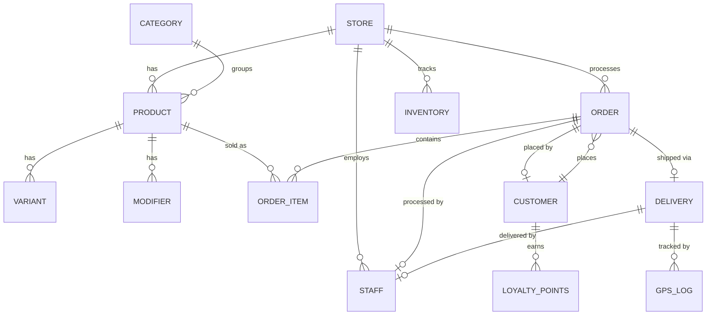

# STATEMENT OF WORK (SOW)

## SkokPOS — Multi-Purpose Point of Sales System

| | |
|---|---|
| **Document Version** | 1.0 |
| **Date** | 3 Juni 2026 |
| **Prepared For** | Susilogiono |
| **Project Name** | SkokPOS |
| **Project Type** | Progressive Web Application (PWA) |
| **Status** | Draft — Pending Approval |

---

## 1. Executive Summary

This Statement of Work defines the scope, deliverables, and technical specifications for the development of **SkokPOS** — a full-featured, offline-first, multi-purpose Point of Sales (POS) system delivered as a Progressive Web Application (PWA).

SkokPOS is designed to serve any business type (retail, F&B, grocery, services) with a comprehensive feature set including real-time checkout, thermal receipt printing, delivery management with live GPS tracking, inventory control, financial reporting, staff management, and customer loyalty programs.

The application will be built with a mobile-first, offline-first architecture ensuring uninterrupted operations even without internet connectivity, with automatic cloud synchronization when connectivity is restored.

---

## 2. Project Objectives

| # | Objective |
|---|---|
| 1 | Deliver a production-ready POS system that works across tablets, phones, and desktops |
| 2 | Enable offline sales processing with zero data loss |
| 3 | Provide real-time delivery tracking with live GPS maps |
| 4 | Support direct thermal receipt printing from the browser |
| 5 | Deliver actionable business intelligence through analytics dashboards |
| 6 | Support multi-store operations from a single platform |
| 7 | Ensure role-based access control for operational security |
| 8 | Provide customer loyalty and retention tools |

---

## 3. Scope of Work

### 3.1 In-Scope

The project is divided into **6 phases** with the following deliverables:

---

#### Phase 1: Project Foundation & Design System

**Objective**: Establish the technical foundation, design language, and responsive application shell.

| # | Deliverable | Description |
|---|---|---|
| 1.1 | Project Initialization | Next.js 15 (App Router) project with TypeScript-ready configuration |
| 1.2 | PWA Configuration | Service Worker, Web App Manifest, offline caching strategy, installability on Android/iOS |
| 1.3 | CSS Design System | Complete design token system (colors, typography, spacing, shadows, animations) with light and dark theme support |
| 1.4 | Application Shell | Responsive layout with collapsible sidebar (desktop/tablet), bottom navigation (mobile), header with search & notifications |
| 1.5 | Firebase Setup | New Firebase project creation, Firestore with offline persistence, Authentication, Realtime Database configuration |
| 1.6 | State Management | Zustand store architecture for cart, products, auth, and settings |

**Acceptance Criteria**:
- App installs as PWA on Android Chrome
- Responsive layout adapts to phone (360px), tablet (768px), and desktop (1280px+)
- Light/dark theme toggle functions correctly
- App shell loads in under 2 seconds on 4G connection

---

#### Phase 2: Product Catalog & Checkout (Core POS)

**Objective**: Build the primary sales interface — the checkout screen where transactions are processed.

| # | Deliverable | Description |
|---|---|---|
| 2.1 | Product Catalog | Product management with name, SKU, barcode, price, cost, image, category, variants (size/color), and modifiers (add-ons) |
| 2.2 | Category Management | Product categories with icons, colors, and sort order |
| 2.3 | Checkout Screen | Split-screen layout — product grid (left 70%) and cart panel (right 30%) |
| 2.4 | Cart Engine | Add/remove items, quantity adjustment, variant/modifier selection, real-time subtotal calculation |
| 2.5 | Discount System | Percentage and fixed-amount discounts at order and item level |
| 2.6 | Tax Calculation | Configurable PPN rate (default 12%), inclusive/exclusive toggle |
| 2.7 | Payment Processing | Mock payment methods: Cash (with change calculation), Card, E-Wallet (GoPay, OVO, DANA), Split Payment |
| 2.8 | Hold & Recall | Park in-progress orders and recall them later |
| 2.9 | Barcode Scanner | Input field that accepts barcode scanner input for instant product lookup |
| 2.10 | Order Numbering | Sequential format: `INV-YYYYMMDD-NNNN` |
| 2.11 | Multi-Store Data | Store/outlet entity with independent product catalogs, pricing, and inventory |

**Acceptance Criteria**:
- Complete sale in ≤ 3 taps (add product → select payment → confirm)
- Barcode input instantly finds matching product
- Tax calculated correctly for both inclusive and exclusive modes
- Split payment across 2+ methods works correctly
- Held orders persist across page refreshes

---

#### Phase 3: Thermal Printing

**Objective**: Enable direct thermal receipt and kitchen ticket printing from the browser.

| # | Deliverable | Description |
|---|---|---|
| 3.1 | ESC/POS Engine | Command builder for text formatting, alignment, bold, font size, barcode, QR code, and paper cut |
| 3.2 | WebUSB Connection | USB thermal printer discovery, pairing, and communication |
| 3.3 | Web Bluetooth | Bluetooth printer fallback for wireless thermal printers |
| 3.4 | Receipt Template | Customizable receipt in Bahasa Indonesia with store info, items, totals, payment details, and footer message |
| 3.5 | Kitchen Ticket (KOT) | Kitchen Order Ticket with large font, order items, table/order number, and timestamp |
| 3.6 | Print Preview | On-screen receipt preview before sending to printer |
| 3.7 | Printer Setup UI | Printer discovery, connection management, and test print functionality |
| 3.8 | Auto-Print | Option to automatically print receipt on order completion |

**Receipt Template Sample**:
```
================================
          SKOKPOS
     Jl. Contoh No. 123
      Tel: 021-1234567
================================
Kasir: Ahmad    03/06/2026 14:30
No: INV-20260603-0001
Outlet: Cabang Utama
--------------------------------
Nasi Goreng Spesial x2 Rp 50.000
Es Teh Manis       x3 Rp 30.000
--------------------------------
Subtotal:          Rp  80.000
Diskon (10%):     -Rp   8.000
PPN (12%):         Rp   8.640
================================
TOTAL:             Rp  80.640
================================
Bayar (Tunai):     Rp 100.000
Kembali:           Rp  19.360
--------------------------------
       Terima Kasih!
   Barang yang sudah dibeli
    tidak dapat dikembalikan
================================
```

**Acceptance Criteria**:
- Receipt prints correctly on 58mm and 80mm thermal printers
- QR code prints and is scannable
- Kitchen ticket prints with large, readable font
- Print preview accurately matches printed output
- Printer connection status visible in app header

---

#### Phase 4: Delivery Management & Live Tracking

**Objective**: Full delivery lifecycle management with real-time GPS tracking.

| # | Deliverable | Description |
|---|---|---|
| 4.1 | Delivery Dashboard | Kanban board with columns: Baru → Diproses → Diambil → Diantar → Selesai |
| 4.2 | Order Cards | Drag-and-drop order cards between status columns |
| 4.3 | Driver Assignment | Assign/reassign delivery drivers to orders |
| 4.4 | Live Map (Admin) | Leaflet + OpenStreetMap map showing all active drivers in real-time |
| 4.5 | Customer Tracking Page | Public page (no login required) with live driver location on map, order details, and ETA |
| 4.6 | Driver Mobile View | Phone-optimized view with current delivery, order queue, one-tap status updates, and GPS broadcasting |
| 4.7 | GPS Tracker | Geolocation API with battery-efficient polling (every 5 seconds during active delivery) |
| 4.8 | Location Sync | Real-time GPS coordinate push to Firebase Realtime Database |
| 4.9 | ETA Calculator | Distance-based estimated time of arrival |
| 4.10 | Demo Simulation | Simulated driver GPS movement for testing/demonstration without a real driver |
| 4.11 | Delivery Timeline | Status change history with timestamps for each order |

**Acceptance Criteria**:
- Driver marker moves smoothly on map (interpolated animation)
- Customer tracking page loads without login and updates in real-time
- Status changes reflect across all views within 2 seconds
- ETA updates as driver moves
- Simulated driver follows a realistic route path

---

#### Phase 5: Inventory, Reports, Staff & Customers

**Objective**: Business management tools for operations, analytics, and customer retention.

##### 5A. Inventory Management

| # | Deliverable | Description |
|---|---|---|
| 5A.1 | Stock Overview | Stock levels table with search, sort, and filter by category/status |
| 5A.2 | Low Stock Alerts | Visual badges and notification for products below minimum threshold |
| 5A.3 | Stock Adjustment | Record stock in/out with reason codes (Purchase, Damage, Transfer, Count) |
| 5A.4 | Stock History | Complete audit log of all stock movements |
| 5A.5 | Bulk Import/Export | CSV import and export for stock data |
| 5A.6 | Multi-Store Stock | Independent stock levels per outlet with inter-store transfer |

##### 5B. Reports & Analytics

| # | Deliverable | Description |
|---|---|---|
| 5B.1 | Dashboard Cards | Today's revenue, order count, average order value, top product |
| 5B.2 | Revenue Chart | Line chart showing revenue over configurable time periods |
| 5B.3 | Category Sales | Donut chart showing sales distribution by product category |
| 5B.4 | Payment Distribution | Bar chart showing breakdown by payment method |
| 5B.5 | Hourly Heatmap | Sales activity heatmap by hour of day |
| 5B.6 | Date Range Picker | Custom date range selection for all reports |
| 5B.7 | Export | Report export to CSV and PDF formats |
| 5B.8 | End-of-Day Report | Daily summary with cash reconciliation |
| 5B.9 | Multi-Store Reports | Aggregate and per-outlet reporting |

##### 5C. Staff Management

| # | Deliverable | Description |
|---|---|---|
| 5C.1 | Staff Directory | Staff list with role, status, and contact information |
| 5C.2 | Role-Based Access | Four roles with distinct permissions: Admin, Kasir (Cashier), Dapur (Kitchen), Driver |
| 5C.3 | PIN Quick Login | 4-6 digit PIN for fast staff switching at the POS terminal |
| 5C.4 | Staff Performance | Per-staff sales tracking and order count |
| 5C.5 | Clock In/Out | Shift time tracking with daily work hours log |

**Role Permission Matrix**:

| Feature | Admin | Kasir | Dapur | Driver |
|---|:---:|:---:|:---:|:---:|
| Checkout / POS | ✅ | ✅ | ❌ | ❌ |
| View Reports | ✅ | ❌ | ❌ | ❌ |
| Manage Inventory | ✅ | ❌ | ❌ | ❌ |
| Manage Staff | ✅ | ❌ | ❌ | ❌ |
| Kitchen Display | ✅ | ❌ | ✅ | ❌ |
| Delivery Board | ✅ | ✅ | ❌ | ❌ |
| Driver View | ❌ | ❌ | ❌ | ✅ |
| Settings | ✅ | ❌ | ❌ | ❌ |
| Manage Customers | ✅ | ✅ | ❌ | ❌ |

##### 5D. Customer Database & Loyalty

| # | Deliverable | Description |
|---|---|---|
| 5D.1 | Customer List | Searchable customer directory with contact info |
| 5D.2 | Purchase History | Order history per customer |
| 5D.3 | Loyalty Points | Points earned per purchase, redeemable for discounts |
| 5D.4 | Customer Tiers | Regular, Silver, Gold, Platinum — with tier-based benefits |

##### 5E. Kitchen Display System (KDS)

| # | Deliverable | Description |
|---|---|---|
| 5E.1 | Order Queue | Full-screen display of incoming orders |
| 5E.2 | Priority Coloring | Color-coded by wait time: green (< 5 min) → yellow (5-10 min) → red (> 10 min) |
| 5E.3 | Item Completion | One-tap to mark individual items as prepared |
| 5E.4 | Audio Alert | Sound notification for new incoming orders |
| 5E.5 | Auto-Dismiss | Completed orders fade out after 30 seconds |

**Acceptance Criteria (Phase 5)**:
- Inventory adjustments immediately reflect in stock levels
- Reports render accurate data matching actual transactions
- Role-based access correctly restricts UI and functionality
- PIN login completes in under 2 seconds
- KDS receives new orders within 3 seconds of checkout
- Loyalty points calculate correctly and apply as discounts

---

#### Phase 6: Settings & Final Polish

| # | Deliverable | Description |
|---|---|---|
| 6.1 | Business Settings | Store name, address, phone, logo configuration |
| 6.2 | Tax Settings | PPN rate and inclusive/exclusive toggle |
| 6.3 | Receipt Customization | Editable header, footer, and promotional text |
| 6.4 | Printer Settings | Connection type selection, test print |
| 6.5 | Notification Settings | Sound and desktop notification preferences |
| 6.6 | Theme Settings | Light/dark mode toggle, accent color selection |
| 6.7 | Language Settings | Switch between Bahasa Indonesia and English |
| 6.8 | Data Backup | Export and import application data (JSON/CSV) |
| 6.9 | Multi-Store Settings | Outlet management — add, edit, switch between stores |
| 6.10 | PWA Optimization | Lighthouse audit, performance tuning, splash screen |

**Acceptance Criteria**:
- All settings persist across sessions
- Language switch updates all UI labels without page reload
- Lighthouse PWA score ≥ 90
- Data export produces valid, re-importable files

---

### 3.2 Out of Scope

The following items are explicitly **not included** in this SOW and may be addressed in future phases:

| # | Item | Notes |
|---|---|---|
| 1 | Real payment gateway integration (Midtrans, Xendit) | Mock payments only; real integration in a future phase |
| 2 | Native mobile app (Play Store / App Store) | PWA only; can be wrapped via TWA later |
| 3 | Accounting / bookkeeping integration | No integration with accounting software (e.g., Accurate, Jurnal) |
| 4 | E-commerce / online ordering portal | No customer-facing web store |
| 5 | Table management (restaurant floor plan) | Not included in initial version |
| 6 | Advanced promotions engine | No buy-one-get-one, time-based promos, or combo deals |
| 7 | Multi-currency support | IDR only; multi-currency in a future phase |
| 8 | Background location tracking (driver) | Foreground tracking only due to browser limitations |
| 9 | Custom domain & SSL setup | Deployment infrastructure not included |
| 10 | User training & documentation | End-user manuals not included |

---

## 4. Technical Architecture

### 4.1 Technology Stack

| Layer | Technology | Version |
|---|---|---|
| Frontend Framework | Next.js (App Router) | 15.x |
| UI Library | React | 19.x |
| Styling | Vanilla CSS (Custom Properties) | — |
| State Management | Zustand | 5.x |
| Data Fetching | TanStack React Query | 5.x |
| Database (Primary) | Firebase Cloud Firestore | — |
| Database (Realtime) | Firebase Realtime Database | — |
| Authentication | Firebase Authentication | — |
| Serverless Functions | Firebase Cloud Functions | — |
| File Storage | Firebase Cloud Storage | — |
| Maps | Leaflet + OpenStreetMap | 1.9.x |
| Charts | Recharts | 2.x |
| Icons | Lucide React | Latest |
| Thermal Printing | Custom ESC/POS via WebUSB / Web Bluetooth | — |

### 4.2 Data Architecture



### 4.3 Offline-First Strategy

| Scenario | Behavior |
|---|---|
| **Normal (Online)** | Read/write to Firestore with real-time sync across devices |
| **Offline** | Read/write to local IndexedDB cache; Firestore SDK queues writes |
| **Reconnection** | Firestore automatically syncs queued writes; conflicts resolved by last-write-wins |
| **PWA Cached** | App shell, static assets, and product catalog cached by Service Worker |
| **Long Offline** | Sequential order numbers use device-local counter; reconciled on sync |

---

## 5. Assumptions & Dependencies

| # | Assumption |
|---|---|
| 1 | Client will create/provide a Google account for Firebase project setup |
| 2 | Thermal printers used are ESC/POS compatible (most 58mm/80mm printers) |
| 3 | Testing devices have Chrome 89+ (WebUSB support) or equivalent |
| 4 | For live GPS tracking tests, Android device with Chrome is available |
| 5 | Internet connectivity is available for initial setup and Firebase project creation |
| 6 | Product images will be provided by the client or generated during development |
| 7 | The Firebase free tier (Spark Plan) is sufficient for development and initial usage |

---

## 6. Delivery & Timeline

| Phase | Description | Estimated Duration |
|---|---|---|
| Phase 1 | Foundation & Design System | 1-2 days |
| Phase 2 | Core POS & Checkout | 2-3 days |
| Phase 3 | Thermal Printing | 1-2 days |
| Phase 4 | Delivery & Live Tracking | 2-3 days |
| Phase 5 | Inventory, Reports, Staff, Customers, KDS | 3-4 days |
| Phase 6 | Settings & Polish | 1-2 days |
| | **Total Estimated** | **10-16 days** |

> [!NOTE]
> Timeline estimates assume focused development sessions. Actual duration may vary based on feedback cycles, requirement changes, and testing.

---

## 7. Acceptance & Approval

### 7.1 Acceptance Criteria Summary

The project will be considered complete when:

1. ✅ All Phase 1-6 deliverables are implemented and functional
2. ✅ App installs as PWA on Android and works offline
3. ✅ Complete checkout flow processes a sale in ≤ 3 taps
4. ✅ Thermal receipt prints correctly on ESC/POS compatible printer
5. ✅ Delivery tracking shows live driver location on map
6. ✅ Reports display accurate data matching transaction records
7. ✅ Role-based access correctly restricts features per role
8. ✅ Multi-store data isolation works correctly
9. ✅ Lighthouse PWA score ≥ 90
10. ✅ App functions in Bahasa Indonesia with language switch to English

### 7.2 Sign-Off

| Role | Name | Signature | Date |
|---|---|---|---|
| Client | | | |
| Developer | | | |

---

## 8. Change Control

Any changes to the scope defined in this SOW must be documented and mutually agreed upon. Changes may affect the timeline and should be evaluated before approval.

| Change # | Description | Impact | Status |
|---|---|---|---|
| | | | |

---

*Document generated on 3 Juni 2026*
*SkokPOS v1.0 — Statement of Work*
