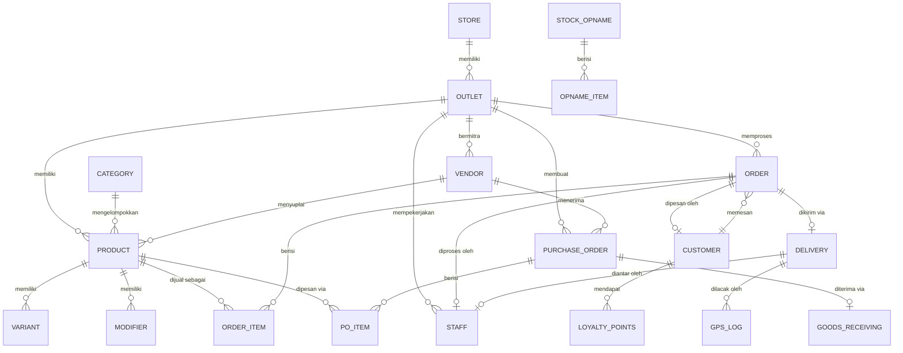

# KERANGKA ACUAN KERJA (KAK)
# STATEMENT OF WORK (SOW)

## SkokPOS — Sistem Point of Sales Multi-Fungsi

| | |
|---|---|
| **Versi Dokumen** | 2.0 |
| **Tanggal** | 3 Juni 2026 |
| **Disiapkan Untuk** | Susilogiono |
| **Nama Proyek** | SkokPOS |
| **Jenis Proyek** | Progressive Web Application (PWA) |
| **Status** | Draft — Menunggu Persetujuan |

---

## 1. Ringkasan Eksekutif

Kerangka Acuan Kerja ini mendefinisikan ruang lingkup, deliverables, dan spesifikasi teknis untuk pengembangan **SkokPOS** — sistem Point of Sales (POS) multi-fungsi yang bekerja secara offline-first, dibangun sebagai Progressive Web Application (PWA).

SkokPOS dirancang untuk melayani berbagai jenis bisnis:
- **🛒 Retail**: Warung, minimarket, toko kelontong, toko retail
- **🍽️ Restoran**: Rumah makan, café, warteg, bakery

Sistem ini memiliki fitur lengkap meliputi: checkout real-time, cetak struk thermal, manajemen pengiriman dengan pelacakan GPS live, manajemen inventaris & vendor, purchase order, stok opname, laporan keuangan, manajemen karyawan, dan program loyalitas pelanggan.

Aplikasi dibangun dengan arsitektur **mobile-first** dan **offline-first**, memastikan operasional tidak terganggu meskipun tanpa koneksi internet, dengan sinkronisasi otomatis saat koneksi pulih.

---

## 2. Tujuan Proyek

| # | Tujuan |
|---|---|
| 1 | Menghasilkan sistem POS siap produksi yang berjalan di tablet, handphone, dan desktop |
| 2 | Memungkinkan penjualan offline tanpa kehilangan data |
| 3 | Menyediakan pelacakan pengiriman real-time dengan peta GPS live |
| 4 | Mendukung cetak struk thermal langsung dari browser |
| 5 | Memberikan laporan bisnis yang actionable melalui dashboard analitik |
| 6 | Mendukung operasional multi-outlet dari satu platform |
| 7 | Menjamin keamanan operasional melalui kontrol akses berbasis peran (5 role) |
| 8 | Menyediakan alat loyalitas dan retensi pelanggan |
| 9 | Mendukung manajemen vendor dan purchase order |
| 10 | Mendukung dua bahasa: Bahasa Indonesia (default) dan English |

---

## 3. Ruang Lingkup Pekerjaan

### 3.1 Dalam Lingkup

Proyek ini dibagi menjadi **6 fase** dengan deliverables sebagai berikut:

---

#### Fase 1: Fondasi Proyek, Sistem Desain & Setup Wizard

**Tujuan**: Membangun fondasi teknis, bahasa desain, dan shell aplikasi responsif.

| # | Deliverable | Deskripsi |
|---|---|---|
| 1.1 | Inisialisasi Proyek | Proyek Next.js 15 (App Router) dengan konfigurasi TypeScript-ready |
| 1.2 | Konfigurasi PWA | Service Worker, Web App Manifest, strategi caching offline, installability di Android/iOS |
| 1.3 | Sistem Desain (Tailwind CSS v4) | Design token berbasis CSS Variables (warna, tipografi, spacing, shadow, animasi) dengan dukungan tema terang dan gelap |
| 1.4 | Komponen UI (Shadcn/ui) | 20+ komponen premium siap pakai: Dialog, Table, Tabs, Sheet, Card, Command, dll. |
| 1.5 | Shell Aplikasi | Layout responsif dengan sidebar collapsible (desktop/tablet), navigasi bawah (mobile), header dengan search & notifikasi |
| 1.6 | Firebase Setup | Pembuatan proyek Firebase baru, Firestore dengan offline persistence, Authentication, Realtime Database, Cloud Storage |
| 1.7 | State Management | Arsitektur Zustand store untuk cart, produk, auth, settings, dan module visibility |
| 1.8 | Sistem i18n (Multi-Bahasa) | Sistem terjemahan berbasis JSON dengan hook React `useTranslation()`. Bahasa Indonesia (default) & English |
| 1.9 | Setup Wizard | Wizard onboarding 4 langkah saat pertama kali buka: Pilih Kategori Toko → Info Bisnis & Logo → Pengaturan Awal → Buat Outlet Pertama |

**Kriteria Penerimaan**:
- App ter-install sebagai PWA di Android Chrome
- Layout responsif menyesuaikan phone (360px), tablet (768px), dan desktop (1280px+)
- Toggle tema terang/gelap berfungsi dengan benar
- App shell dimuat dalam waktu kurang dari 2 detik pada koneksi 4G
- Switch bahasa Indonesia ↔ English tanpa reload halaman
- Setup Wizard menampilkan data contoh sesuai kategori toko yang dipilih

---

#### Fase 2: Katalog Produk & Checkout (POS Inti)

**Tujuan**: Membangun antarmuka penjualan utama — layar checkout tempat transaksi diproses.

| # | Deliverable | Deskripsi |
|---|---|---|
| 2.1 | Katalog Produk | Manajemen produk: nama, SKU, barcode, harga jual, harga beli (HPP), gambar, kategori, varian (ukuran/warna), modifier (add-on), vendor terkait |
| 2.2 | Manajemen Kategori | Kategori produk dengan ikon, warna, dan urutan sort |
| 2.3 | Layar Checkout | Layout split-screen — grid produk (kiri 70%) dan panel keranjang (kanan 30%) |
| 2.4 | Mesin Keranjang | Tambah/hapus item, penyesuaian jumlah, pilihan varian/modifier, perhitungan subtotal real-time |
| 2.5 | Sistem Diskon | Diskon persentase dan nominal tetap di level pesanan dan item |
| 2.6 | Perhitungan Pajak | Tarif PPN konfigurabel (default 12%), toggle inklusif/eksklusif |
| 2.7 | Pemrosesan Pembayaran | Metode pembayaran mock: Tunai (dengan perhitungan kembalian), Kartu, E-Wallet (GoPay, OVO, DANA), Split Payment |
| 2.8 | Tahan & Ambil Pesanan | Parkir pesanan yang sedang diproses dan ambil kembali nanti |
| 2.9 | Barcode Scanner | Input field yang menerima input barcode scanner untuk pencarian produk instan |
| 2.10 | Penomoran Pesanan | Format sekuensial: `INV-YYYYMMDD-NNNN` |
| 2.11 | Data Multi-Outlet | Entitas toko/outlet dengan katalog produk, harga, dan inventaris independen |
| 2.12 | Mode Toko Dinamis | UI adaptif berdasarkan mode toko (Retail/Restoran) — fitur restoran (modifier, meja, KDS) otomatis muncul/tersembunyi |

**Fitur Khusus Restoran (🍽️)**:
- Toggle tipe pesanan (Makan di Tempat / Bawa Pulang)
- Input nomor meja
- Pilihan modifier/add-on saat menambah produk

**Kriteria Penerimaan**:
- Penjualan selesai dalam ≤ 3 tap (tambah produk → pilih pembayaran → konfirmasi)
- Input barcode langsung menemukan produk yang cocok
- Pajak dihitung dengan benar untuk mode inklusif dan eksklusif
- Split payment dengan 2+ metode berfungsi dengan benar
- Pesanan yang ditahan bertahan meskipun halaman di-refresh
- Fitur restoran tersembunyi saat mode Retail, dan sebaliknya

---

#### Fase 3: Cetak Struk Thermal

**Tujuan**: Mengaktifkan cetak struk thermal dan tiket dapur langsung dari browser.

| # | Deliverable | Deskripsi |
|---|---|---|
| 3.1 | Mesin ESC/POS | Pembuat perintah untuk format teks, alignment, bold, ukuran font, barcode, QR code, dan potong kertas |
| 3.2 | Koneksi WebUSB | Pencarian, pairing, dan komunikasi printer thermal USB |
| 3.3 | Web Bluetooth | Fallback printer Bluetooth untuk printer thermal wireless |
| 3.4 | Template Struk | Struk kustom dalam Bahasa Indonesia dengan info toko, logo, item, total, detail pembayaran, dan pesan footer |
| 3.5 | Tiket Dapur (KOT) | 🍽️ Kitchen Order Ticket dengan font besar, item pesanan, nomor meja/pesanan, dan timestamp |
| 3.6 | Preview Cetak | Preview struk di layar sebelum dikirim ke printer |
| 3.7 | UI Setup Printer | Pencarian printer, manajemen koneksi, dan fungsi test print |
| 3.8 | Auto-Print | Opsi cetak struk otomatis saat pesanan selesai |
| 3.9 | Logo pada Struk | Logo toko tercetak di bagian atas struk (dikonversi ke bitmap ESC/POS) |

**Contoh Template Struk:**

**🛒 Struk Retail:**
```
================================
        SKOKPOS
     Jl. Contoh No. 123
      Tel: 021-1234567
================================
Kasir: Ahmad    03/06/2026 14:30
No: INV-20260603-0001
Outlet: Cabang Utama
--------------------------------
Indomie Goreng   x5  Rp  17.500
Aqua 600ml       x3  Rp  12.000
--------------------------------
Subtotal:           Rp  29.500
PPN (12%):          Rp   3.540
================================
TOTAL:              Rp  33.040
================================
Bayar (Tunai):      Rp  50.000
Kembali:            Rp  16.960
--------------------------------
       Terima Kasih!
================================
```

**🍽️ Struk Restoran:**
```
================================
        SKOKPOS
     Jl. Contoh No. 123
      Tel: 021-1234567
================================
Kasir: Ahmad    03/06/2026 14:30
No: INV-20260603-0001
Outlet: Cabang Utama
Tipe: Dine-in | Meja: 5
--------------------------------
Nasi Goreng Spesial x2 Rp 50.000
  + Telur Ceplok     x2 Rp  6.000
  + Level Pedas 3
Es Teh Manis        x3 Rp 30.000
--------------------------------
Subtotal:           Rp  86.000
Diskon (10%):      -Rp   8.600
PPN (12%):          Rp   9.288
================================
TOTAL:              Rp  86.688
================================
Bayar (Tunai):      Rp 100.000
Kembali:            Rp  13.312
--------------------------------
       Terima Kasih!
  Barang yang sudah dibeli
   tidak dapat dikembalikan
================================
```

**Kriteria Penerimaan**:
- Struk tercetak dengan benar pada printer thermal 58mm dan 80mm
- QR code tercetak dan dapat di-scan
- Logo toko tercetak di bagian atas struk
- Tiket dapur tercetak dengan font besar dan mudah dibaca
- Preview cetak akurat sesuai output cetak
- Status koneksi printer terlihat di header aplikasi

---

#### Fase 4: Manajemen Pengiriman & Pelacakan Live

**Tujuan**: Manajemen siklus pengiriman lengkap dengan pelacakan GPS real-time.

| # | Deliverable | Deskripsi |
|---|---|---|
| 4.1 | Dashboard Pengiriman | Papan Kanban: Baru → Diproses → Diambil → Diantar → Selesai |
| 4.2 | Kartu Pesanan | Drag-and-drop kartu pesanan antar kolom status |
| 4.3 | Penugasan Driver | Assign/reassign driver pengiriman ke pesanan |
| 4.4 | Peta Live (Admin) | Peta Leaflet + OpenStreetMap menampilkan semua driver aktif secara real-time |
| 4.5 | Halaman Tracking Pelanggan | Halaman publik (tanpa login) dengan lokasi driver live di peta, detail pesanan, dan ETA |
| 4.6 | Tampilan Mobile Driver | Tampilan dioptimalkan untuk handphone: pengiriman saat ini, antrean pesanan, update status satu-tap, dan broadcasting GPS |
| 4.7 | Pelacak GPS | Geolocation API dengan polling hemat baterai (setiap 5 detik saat pengiriman aktif) |
| 4.8 | Sinkronisasi Lokasi | Push koordinat GPS real-time ke Firebase Realtime Database |
| 4.9 | Kalkulator ETA | Estimasi waktu tiba berbasis jarak |
| 4.10 | Simulasi Demo | Simulasi pergerakan GPS driver untuk testing/demo tanpa driver asli |
| 4.11 | Timeline Pengiriman | Riwayat perubahan status dengan timestamp untuk setiap pesanan |

**Kriteria Penerimaan**:
- Marker driver bergerak halus di peta (animasi interpolasi)
- Halaman tracking pelanggan dimuat tanpa login dan update secara real-time
- Perubahan status tercermin di semua tampilan dalam 2 detik
- ETA diperbarui saat driver bergerak
- Simulasi driver mengikuti rute path yang realistis

---

#### Fase 5: Inventaris, Vendor, Purchase Order, Laporan, Karyawan & Pelanggan

**Tujuan**: Alat manajemen bisnis untuk operasional, analitik, dan retensi pelanggan.

##### 5A. Manajemen Inventaris

| # | Deliverable | Deskripsi |
|---|---|---|
| 5A.1 | Ringkasan Stok | Tabel level stok dengan pencarian, sort, dan filter berdasarkan kategori/status |
| 5A.2 | Peringatan Stok Rendah | Badge visual dan notifikasi untuk produk di bawah ambang batas minimum |
| 5A.3 | Penyesuaian Stok | Catat stok masuk/keluar dengan kode alasan (Pembelian, Kerusakan, Transfer, Hitung) |
| 5A.4 | Riwayat Stok | Log audit lengkap semua pergerakan stok |
| 5A.5 | Import/Ekspor Massal | Import dan ekspor data stok via CSV |
| 5A.6 | Stok Multi-Outlet | Level stok independen per outlet |
| 5A.7 | Ambang Batas Minimum | Stok minimum per produk (memicu smart reorder) |

##### 5B. Manajemen Vendor / Supplier

| # | Deliverable | Deskripsi |
|---|---|---|
| 5B.1 | Daftar Vendor | Daftar vendor dengan pencarian, filter status (aktif/tidak aktif) |
| 5B.2 | Tambah/Edit Vendor | Nama, kontak person, telepon, email, alamat, catatan |
| 5B.3 | Hubungkan Produk | Link produk ke vendor — vendor mana menyuplai produk apa |
| 5B.4 | Performa Vendor | Total pembelian, tanggal order terakhir, rata-rata waktu pengiriman |
| 5B.5 | Riwayat Pembelian | Riwayat pembelian per vendor |
| 5B.6 | Quick Action | Buat PO langsung dari halaman vendor |

##### 5C. Pesanan Pembelian (Purchase Order / PO)

| # | Deliverable | Deskripsi |
|---|---|---|
| 5C.1 | Daftar PO | List PO dengan tab status: Semua, Draft, Dikirim, Diterima, Dibatalkan |
| 5C.2 | Buat PO | Pilih vendor → auto-populate produk vendor → tambah item dengan qty & harga → hitung otomatis |
| 5C.3 | Nomor PO | Format: `PO-YYYYMMDD-NNNN` |
| 5C.4 | Alur Status PO | Draft → Dikirim → Diterima (Sebagian/Penuh) → Selesai / Dibatalkan |
| 5C.5 | Kirim PO ke Vendor | Share via WhatsApp (teks terformat), ekspor PDF (dengan logo toko), copy link |
| 5C.6 | Terima Barang | View item PO dengan qty yang diharapkan, input qty diterima, auto-update inventaris |
| 5C.7 | Penerimaan Sebagian | Opsi buat PO baru untuk item yang belum diterima |
| 5C.8 | Cetak Slip Penerimaan | Cetak slip penerimaan pada printer thermal |

##### 5D. Stok Opname (Hitung Fisik)

| # | Deliverable | Deskripsi |
|---|---|---|
| 5D.1 | Sesi Opname Baru | Mulai sesi stok opname baru |
| 5D.2 | Input Hitung Fisik | Scan barcode atau cari produk → input jumlah fisik |
| 5D.3 | Perbandingan | Stok sistem vs stok fisik dengan kolom selisih |
| 5D.4 | Kode Warna | 🟢 Cocok, 🟡 Selisih kecil, 🔴 Selisih besar |
| 5D.5 | Approval | Persetujuan penyesuaian oleh Super Admin / Admin |
| 5D.6 | Log Otomatis | Auto-generate log penyesuaian dengan alasan "Stok Opname" |
| 5D.7 | Riwayat | Riwayat sesi opname sebelumnya |

##### 5E. Smart Reorder (Restock Otomatis)

| # | Deliverable | Deskripsi |
|---|---|---|
| 5E.1 | Widget Dashboard | "Produk Perlu Restock" — produk dengan stok ≤ minimum |
| 5E.2 | Auto-Suggest PO | Satu klik: buat draft PO otomatis dikelompokkan per vendor |
| 5E.3 | Suggested Qty | Qty saran = (stok minimum × 2) − stok saat ini (multiplier konfigurabel) |
| 5E.4 | Notifikasi | Push notification untuk peringatan stok rendah |

##### 5F. Laporan & Analitik

Suite laporan komprehensif dengan 8 kategori:

| # | Kategori Laporan | Detail |
|---|---|---|
| 5F.1 | **📊 Dashboard Harian** | Pendapatan hari ini vs kemarin (% perubahan), jumlah order, rata-rata nilai order, top 5 produk, stok rendah, PO pending |
| 5F.2 | **💰 Laporan Penjualan** | Per hari/minggu/bulan (line chart), per produk (best seller), per kategori (donut), per outlet, per kasir, per jam (heatmap), per metode bayar, per tipe order, trend penjualan |
| 5F.3 | **📦 Laporan Inventaris** | Stok saat ini, stok rendah & habis, pergerakan stok, nilai inventaris (stok × HPP), riwayat stok opname |
| 5F.4 | **🏦 Laporan Pembelian** | Pembelian per vendor, riwayat PO, trend harga beli, performa vendor |
| 5F.5 | **👥 Laporan Pelanggan** | Pelanggan terbanyak, pelanggan baru, ringkasan loyalty points, frekuensi kunjungan |
| 5F.6 | **👨‍💼 Laporan Karyawan** | Penjualan per kasir, jumlah transaksi per kasir, performa driver |
| 5F.7 | **🚚 Laporan Pengiriman** | Delivery per hari, delivery per driver, rata-rata waktu kirim |
| 5F.8 | **💸 Laporan Keuangan Sederhana** | Laba rugi sederhana (pendapatan − HPP = laba kotor), pajak terkumpul, diskon diberikan, ringkasan kas |

**Format Ekspor:**
- 📄 PDF (dengan logo toko)
- 📊 CSV / Excel
- 📱 Share via WhatsApp (ringkasan harian)
- 🧱 Cetak thermal (ringkasan akhir hari pada printer struk)

##### 5G. Manajemen Karyawan

| # | Deliverable | Deskripsi |
|---|---|---|
| 5G.1 | Direktori Karyawan | Daftar karyawan dengan role, status, dan informasi kontak |
| 5G.2 | Kontrol Akses Berbasis Peran | Lima peran dengan hak akses berbeda (lihat matriks di bawah) |
| 5G.3 | Login PIN Cepat | PIN 4-6 digit untuk pergantian staf cepat di terminal POS |
| 5G.4 | Performa Karyawan | Tracking penjualan per staf dan jumlah transaksi |
| 5G.5 | Absensi Masuk/Keluar | Tracking waktu shift dengan log jam kerja harian |

**Hierarki Peran & Matriks Hak Akses:**

| Fitur | 🔑 Super Admin | 👔 Admin | 💳 Kasir | 🍳 Dapur | 🚚 Driver |
|---|:---:|:---:|:---:|:---:|:---:|
| Ganti kategori toko | ✅ | ❌ | ❌ | ❌ | ❌ |
| Kelola outlet | ✅ | ❌ | ❌ | ❌ | ❌ |
| Ubah tarif pajak | ✅ | ❌ | ❌ | ❌ | ❌ |
| Kelola staff & roles | ✅ | ❌ | ❌ | ❌ | ❌ |
| Kelola modul (show/hide) | ✅ | ❌ | ❌ | ❌ | ❌ |
| Hapus data / reset | ✅ | ❌ | ❌ | ❌ | ❌ |
| Backup / restore | ✅ | ❌ | ❌ | ❌ | ❌ |
| Lihat laporan | ✅ | ✅ | ❌ | ❌ | ❌ |
| Kelola inventaris | ✅ | ✅ | ❌ | ❌ | ❌ |
| Kelola vendor | ✅ | ✅ | ❌ | ❌ | ❌ |
| Buat & kelola PO | ✅ | ✅ | ❌ | ❌ | ❌ |
| Terima barang | ✅ | ✅ | ❌ | ❌ | ❌ |
| Stok opname | ✅ | ✅ | ❌ | ❌ | ❌ |
| Kelola pelanggan | ✅ | ✅ | ✅ | ❌ | ❌ |
| Checkout / POS | ✅ | ❌ | ✅ | ❌ | ❌ |
| Kitchen Display | ✅ | ❌ | ❌ | ✅ | ❌ |
| Delivery Board | ✅ | ✅ | ✅ | ❌ | ❌ |
| Driver View | ❌ | ❌ | ❌ | ❌ | ✅ |
| Printer & struk | ✅ | ✅ | ❌ | ❌ | ❌ |
| Tema & bahasa | ✅ | ✅ | ✅ | ✅ | ✅ |

> [!NOTE]
> **Super Admin** otomatis dibuat saat seseorang menyelesaikan Setup Wizard pertama kali.

##### 5H. Database Pelanggan & Loyalitas

| # | Deliverable | Deskripsi |
|---|---|---|
| 5H.1 | Daftar Pelanggan | Direktori pelanggan yang dapat dicari dengan info kontak |
| 5H.2 | Riwayat Pembelian | Riwayat pesanan per pelanggan |
| 5H.3 | Poin Loyalitas | Poin diperoleh per pembelian, dapat ditukar dengan diskon |
| 5H.4 | Tier Pelanggan | Regular, Silver, Gold, Platinum — dengan benefit per tier |

##### 5I. Kitchen Display System / KDS (🍽️ Restoran)

| # | Deliverable | Deskripsi |
|---|---|---|
| 5I.1 | Antrean Pesanan | Tampilan layar penuh pesanan masuk |
| 5I.2 | Pewarnaan Prioritas | Kode warna berdasarkan waktu tunggu: hijau (< 5 menit) → kuning (5-10 menit) → merah (> 10 menit) |
| 5I.3 | Penyelesaian Item | Satu-tap untuk menandai item selesai dimasak |
| 5I.4 | Alert Audio | Notifikasi suara untuk pesanan baru masuk |
| 5I.5 | Auto-Dismiss | Pesanan selesai menghilang setelah 30 detik |

**Kriteria Penerimaan (Fase 5)**:
- Penyesuaian inventaris langsung tercermin di level stok
- PO berhasil dikirim via WhatsApp dan PDF
- Penerimaan barang otomatis update stok
- Stok opname menampilkan perbandingan sistem vs fisik dengan kode warna
- Laporan menampilkan data akurat sesuai transaksi aktual
- Kontrol akses berbasis peran membatasi UI dan fungsionalitas dengan benar
- Login PIN selesai dalam waktu kurang dari 2 detik
- KDS menerima pesanan baru dalam 3 detik setelah checkout
- Poin loyalitas dihitung dengan benar dan dapat digunakan sebagai diskon

---

#### Fase 6: Pengaturan, Konfigurasi & Polish Akhir

| # | Deliverable | Deskripsi |
|---|---|---|
| 6.1 | Pengaturan Bisnis | Konfigurasi nama toko, alamat, telepon, logo |
| 6.2 | Upload Logo | Upload drag-and-drop, preview & crop, resize 512x512px, simpan di Firebase Cloud Storage |
| 6.3 | Pengaturan Pajak | Tarif PPN dan toggle inklusif/eksklusif |
| 6.4 | Kustomisasi Struk | Header, footer, dan teks promosi yang dapat diedit |
| 6.5 | Pengaturan Printer | Pilihan tipe koneksi, test print |
| 6.6 | Pengaturan Notifikasi | Preferensi suara dan notifikasi desktop |
| 6.7 | Pengaturan Tema | Toggle mode terang/gelap, pilihan warna aksen |
| 6.8 | Pengaturan Bahasa | Switch Bahasa Indonesia ↔ English |
| 6.9 | Backup Data | Ekspor dan impor data aplikasi (JSON/CSV) |
| 6.10 | Pengaturan Multi-Outlet | Manajemen outlet — tambah, edit, switch antar toko |
| 6.11 | **Kelola Modul (Super Admin)** | Show/hide modul per outlet untuk menyederhanakan UI |
| 6.12 | Optimasi PWA | Audit Lighthouse, tuning performa, splash screen |

**Modul yang Dapat Ditampilkan/Disembunyikan:**

| Modul | Default (🛒 Retail) | Default (🍽️ Restoran) | Saat Disembunyikan |
|---|:---:|:---:|---|
| 🚚 Pengiriman | ✅ | ✅ | Menu pengiriman & driver dihapus |
| 🏦 Vendor | ✅ | ✅ | Halaman vendor tersembunyi |
| 📝 Pesanan Pembelian | ✅ | ✅ | Halaman PO & penerimaan tersembunyi |
| 📋 Stok Opname | ✅ | ✅ | Halaman stok opname tersembunyi |
| 👥 Pelanggan & Loyalty | ✅ | ✅ | Halaman pelanggan tersembunyi |
| 🍳 Dapur / KDS | ❌ | ✅ | Kitchen display & cetak KOT tersembunyi |
| 🍽️ Meja / Table | ❌ | ✅ | Input nomor meja tersembunyi |
| 🌟 Modifier / Add-on | ❌ | ✅ | Picker modifier tersembunyi |
| 📊 Laporan Lanjutan | ✅ | ✅ | Laporan lanjutan tersembunyi (dashboard tetap ada) |
| 🔔 Smart Reorder | ✅ | ✅ | Saran restock otomatis dinonaktifkan |

**Kriteria Penerimaan**:
- Semua pengaturan tersimpan antar sesi
- Switch bahasa memperbarui semua label UI tanpa reload halaman
- Logo tercetak di struk thermal
- Skor Lighthouse PWA ≥ 90
- Ekspor data menghasilkan file yang valid dan dapat di-impor kembali
- Modul yang disembunyikan tidak muncul di sidebar dan redirect ke /checkout jika diakses langsung

---

### 3.2 Di Luar Lingkup

Item-item berikut secara eksplisit **tidak termasuk** dalam SOW ini dan dapat dialamatkan di fase berikutnya:

| # | Item | Catatan |
|---|---|---|
| 1 | Integrasi payment gateway nyata (Midtrans, Xendit) | Hanya pembayaran mock; integrasi nyata di fase berikutnya |
| 2 | Aplikasi mobile native (Play Store / App Store) | Hanya PWA; dapat dibungkus via TWA nanti |
| 3 | Integrasi akuntansi / pembukuan | Tidak ada integrasi dengan software akuntansi (Accurate, Jurnal) |
| 4 | E-commerce / portal pemesanan online | Tidak ada web store untuk pelanggan |
| 5 | Manajemen meja restoran (floor plan) | Tidak termasuk dalam versi awal |
| 6 | Mesin promosi lanjutan | Tidak ada beli-satu-gratis-satu, promo berbasis waktu, atau combo |
| 7 | Dukungan multi-mata uang | Hanya IDR; multi-mata uang di fase berikutnya |
| 8 | Pelacakan lokasi background (driver) | Hanya pelacakan foreground karena keterbatasan browser |
| 9 | Setup domain kustom & SSL | Infrastruktur deployment tidak termasuk |
| 10 | Pelatihan pengguna & dokumentasi | Manual pengguna akhir tidak termasuk |

---

## 4. Arsitektur Teknis

### 4.1 Stack Teknologi

| Layer | Teknologi | Versi |
|---|---|---|
| Framework Frontend | Next.js (App Router) | 15.x |
| Library UI | React | 19.x |
| Styling | **Tailwind CSS** | **v4** |
| Komponen UI | **Shadcn/ui** | Latest |
| State Management | Zustand | 5.x |
| Data Fetching | TanStack React Query | 5.x |
| Database (Utama) | Firebase Cloud Firestore | — |
| Database (Realtime) | Firebase Realtime Database | — |
| Authentication | Firebase Authentication | — |
| Serverless Functions | Firebase Cloud Functions | — |
| File Storage | Firebase Cloud Storage | — |
| Peta | Leaflet + OpenStreetMap | 1.9.x |
| Chart | Shadcn/ui Charts (Recharts) | 2.x |
| Ikon | Lucide React | Latest |
| Cetak Thermal | Custom ESC/POS via WebUSB / Web Bluetooth | — |
| Bahasa | Bahasa Indonesia (default) + English | — |

### 4.2 Arsitektur Data



### 4.3 Model Data

```
Store:         { id, name, address, phone, logo, storeMode, taxRate, taxInclusive, language, createdAt }
Outlet:        { id, storeId, name, address, storeMode, modules, isActive }
Product:       { id, name, sku, barcode, categoryId, price, cost, image, variants[], modifiers[], isActive, stock, minStock, outletId, vendorId }
Order:         { id, orderNumber, items[], subtotal, discount, tax, total, paymentMethod, status, cashierId, customerId, outletId, orderType, tableNumber, createdAt }
Category:      { id, name, icon, color, sortOrder }
Modifier:      { id, name, price, group, isRequired }
Vendor:        { id, name, contactPerson, phone, email, address, notes, products[], isActive, outletId, createdAt }
PurchaseOrder: { id, poNumber, vendorId, outletId, items[], status, subtotal, tax, total, notes, createdBy, createdAt, sentAt, receivedAt }
POItem:        { productId, productName, qty, qtyReceived, unitPrice, subtotal }
StockOpname:   { id, outletId, items[], status, countedBy, approvedBy, createdAt, completedAt }
Customer:      { id, name, phone, email, tier, points, totalSpent, outletId, createdAt }
Staff:         { id, name, phone, email, role, pin, isActive, outletId, createdAt }
```

### 4.4 Strategi Offline-First

| Skenario | Perilaku |
|---|---|
| **Normal (Online)** | Baca/tulis ke Firestore dengan sinkronisasi real-time antar perangkat |
| **Offline** | Baca/tulis ke cache IndexedDB lokal; Firestore SDK mengantrikan penulisan |
| **Koneksi Pulih** | Firestore otomatis menyinkronkan penulisan yang diantrikan; konflik diselesaikan dengan last-write-wins |
| **PWA Cached** | Shell aplikasi, aset statis, dan katalog produk di-cache oleh Service Worker |
| **Offline Lama** | Nomor pesanan sekuensial menggunakan counter lokal perangkat; direkonsiliasi saat sinkronisasi |

---

## 5. Asumsi & Dependensi

| # | Asumsi |
|---|---|
| 1 | Klien akan membuat/menyediakan akun Google untuk setup proyek Firebase |
| 2 | Printer thermal yang digunakan kompatibel ESC/POS (kebanyakan printer 58mm/80mm) |
| 3 | Perangkat testing memiliki Chrome 89+ (dukungan WebUSB) atau setara |
| 4 | Untuk test pelacakan GPS live, perangkat Android dengan Chrome tersedia |
| 5 | Konektivitas internet tersedia untuk setup awal dan pembuatan proyek Firebase |
| 6 | Gambar produk akan disediakan oleh klien atau di-generate selama pengembangan |
| 7 | Firebase free tier (Spark Plan) cukup untuk pengembangan dan penggunaan awal |

---

## 6. Pengiriman & Timeline

| Fase | Deskripsi | Estimasi Durasi |
|---|---|---|
| Fase 1 | Fondasi, Sistem Desain & Setup Wizard | 2-3 hari |
| Fase 2 | POS Inti & Checkout | 3-4 hari |
| Fase 3 | Cetak Struk Thermal | 1-2 hari |
| Fase 4 | Pengiriman & Pelacakan Live | 2-3 hari |
| Fase 5 | Inventaris, Vendor, PO, Stok Opname, Laporan, Karyawan, Pelanggan, KDS | 5-7 hari |
| Fase 6 | Pengaturan, Kelola Modul & Polish | 2-3 hari |
| | **Total Estimasi** | **15-22 hari** |

> [!NOTE]
> Estimasi timeline mengasumsikan sesi pengembangan terfokus. Durasi aktual dapat bervariasi berdasarkan siklus feedback, perubahan requirement, dan testing.

---

## 7. Penerimaan & Persetujuan

### 7.1 Ringkasan Kriteria Penerimaan

Proyek dianggap selesai ketika:

1. ✅ Semua deliverable Fase 1-6 telah diimplementasikan dan fungsional
2. ✅ App ter-install sebagai PWA di Android dan berfungsi offline
3. ✅ Alur checkout lengkap memproses penjualan dalam ≤ 3 tap
4. ✅ Struk thermal tercetak dengan benar pada printer ESC/POS compatible
5. ✅ Pelacakan pengiriman menampilkan lokasi driver live di peta
6. ✅ Laporan menampilkan data akurat sesuai catatan transaksi
7. ✅ Kontrol akses berbasis peran (5 role) membatasi fitur per peran dengan benar
8. ✅ Isolasi data multi-outlet berfungsi dengan benar
9. ✅ Skor Lighthouse PWA ≥ 90
10. ✅ App berfungsi dalam Bahasa Indonesia dengan switch bahasa ke English
11. ✅ Vendor management dan purchase order berfungsi end-to-end
12. ✅ Stok opname menampilkan perbandingan sistem vs fisik
13. ✅ Smart reorder menghasilkan saran PO otomatis
14. ✅ Module visibility (show/hide) berfungsi sesuai konfigurasi Super Admin

### 7.2 Tanda Tangan Persetujuan

| Peran | Nama | Tanda Tangan | Tanggal |
|---|---|---|---|
| Klien | | | |
| Developer | | | |

---

## 8. Pengendalian Perubahan

Setiap perubahan terhadap ruang lingkup yang didefinisikan dalam SOW ini harus didokumentasikan dan disetujui bersama. Perubahan dapat mempengaruhi timeline dan harus dievaluasi sebelum disetujui.

| Perubahan # | Deskripsi | Dampak | Status |
|---|---|---|---|
| | | | |

---

*Dokumen dibuat pada 3 Juni 2026*
*SkokPOS v2.0 — Kerangka Acuan Kerja / Statement of Work*
