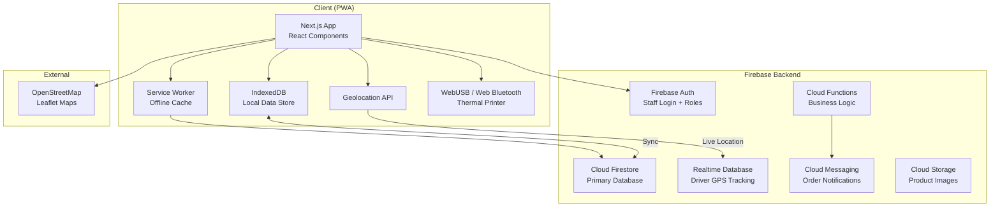

# SkokPOS — Multi-Purpose POS System

A full-featured, offline-first Point of Sales PWA with delivery live tracking, thermal printing, and sales best practices.

## Architecture Overview



## Tech Stack

| Layer | Technology | Rationale |
|---|---|---|
| **Framework** | Next.js 15 (App Router) | SSR, API routes, PWA-ready |
| **UI** | React 19 + Vanilla CSS | Full control, design system tokens |
| **State** | Zustand + React Query | Lightweight, offline-friendly |
| **Database** | Firebase Firestore | Real-time sync, offline persistence |
| **GPS Tracking** | Firebase Realtime DB | Ultra-low latency location updates |
| **Auth** | Firebase Auth | Role-based access (Admin/Cashier/Kitchen/Driver) |
| **Maps** | Leaflet + OpenStreetMap | Free, no API key needed |
| **Printing** | ESC/POS via WebUSB | Direct thermal printer communication |
| **Offline** | Service Worker + IndexedDB | Full offline-first capability |
| **Currency** | IDR (Indonesian Rupiah) | Default with formatting (Rp 50.000) |
| **Icons** | Lucide React | Modern, consistent icon set |

---

## Decisions (Confirmed)

- ✅ **App Name**: SkokPOS
- ✅ **Firebase Project**: Create new project
- ✅ **Tax Rate**: 12% PPN (configurable)
- ✅ **Receipt Language**: Bahasa Indonesia (adjustable/switchable)
- ✅ **Multi-outlet**: Yes, multi-store support included
- ✅ **Payment Gateway**: Mock for now (Midtrans/Xendit integration later)

> [!NOTE]
> **Thermal Printer**: WebUSB requires HTTPS or localhost. For testing on Android over WiFi, we'll use ngrok or a self-signed certificate.

> [!NOTE]
> **GPS Tracking**: Initial version tracks driver location while the app is in the foreground.

---

## Proposed Changes

### Phase 1: Project Foundation & Design System

#### [NEW] Project Setup
- Initialize Next.js 15 project with App Router
- Configure PWA with `next-pwa` (Service Worker, manifest.json)
- Set up Firebase SDK (Auth, Firestore, Realtime DB)
- Configure offline persistence

#### [NEW] `src/styles/globals.css` — Design System
Complete CSS design system with:
- **CSS Custom Properties**: Color palette (light/dark), spacing, typography, shadows, border-radius
- **Color Palette**: Professional blue-indigo primary, warm accent colors, semantic colors for success/warning/error
- **Typography**: Inter font from Google Fonts, responsive scale
- **Components**: Button variants, cards, inputs, badges, modals, tables
- **Animations**: Subtle transitions, loading skeletons, slide-ins
- **Responsive**: Mobile-first breakpoints for phone/tablet/desktop

#### [NEW] `src/components/layout/` — App Shell
- `Sidebar.jsx` — Collapsible navigation with role-based menu items
- `Header.jsx` — Search, notifications bell, user avatar, dark mode toggle
- `MobileNav.jsx` — Bottom tab navigation for phone screens
- `AppShell.jsx` — Responsive layout wrapper (sidebar on desktop, bottom nav on mobile)

---

### Phase 2: Product Catalog & Checkout (Core POS)

#### [NEW] `src/stores/` — State Management (Zustand)
- `cartStore.js` — Cart state (items, quantities, discounts, tax, total)
- `productStore.js` — Product catalog with search/filter
- `authStore.js` — User session and role
- `settingsStore.js` — App settings (tax rate, currency, printer config)

#### [NEW] `src/app/(pos)/checkout/page.jsx` — Main POS Screen
The heart of the app — split-screen layout:
- **Left panel (70%)**: Product grid with categories, search bar, and barcode scanner input
- **Right panel (30%)**: Cart with running total, discount controls, and payment buttons
- Product cards with image, name, price, and quick-add
- Category tabs with horizontal scrolling
- Real-time search with debounce
- Quantity adjustment (+/−) in cart
- Hold order / Recall order functionality

#### [NEW] `src/app/(pos)/checkout/components/`
- `ProductGrid.jsx` — Responsive product grid with category filtering
- `ProductCard.jsx` — Individual product card with variant/modifier support
- `CartPanel.jsx` — Shopping cart with line items
- `CartItem.jsx` — Single cart item with qty controls
- `PaymentModal.jsx` — Payment method selection and processing
- `DiscountModal.jsx` — Apply percentage or fixed discount
- `HeldOrdersDrawer.jsx` — View and recall held orders
- `BarcodeInput.jsx` — Invisible input field for barcode scanner

#### [NEW] `src/lib/firebase/` — Firebase Configuration
- `config.js` — Firebase app initialization
- `firestore.js` — Firestore helpers with offline persistence
- `auth.js` — Authentication helpers
- `realtime.js` — Realtime Database for GPS tracking

#### [NEW] `src/lib/models/` — Data Models
```
Product: { id, name, sku, barcode, categoryId, price, cost, image, variants[], modifiers[], isActive, stock }
Order: { id, orderNumber, items[], subtotal, discount, tax, total, paymentMethod, status, cashierId, customerId, createdAt }
Category: { id, name, icon, color, sortOrder }
```

---

### Phase 3: Thermal Printing

#### [NEW] `src/lib/printer/`
- `escpos.js` — ESC/POS command builder (text formatting, alignment, barcode, QR code, cut paper)
- `usbPrinter.js` — WebUSB connection manager (discover, connect, print)
- `bluetoothPrinter.js` — Web Bluetooth fallback for wireless printers
- `receiptTemplate.js` — Receipt layout builder:
  ```
  ================================
         KASIRPRO
      Jl. Example No. 123
       Tel: 021-1234567
  ================================
  Kasir: Ahmad    03/06/2026 14:30
  No: INV-20260603-0001
  --------------------------------
  Nasi Goreng  x2     Rp  50.000
  Es Teh Manis x3     Rp  30.000
  --------------------------------
  Subtotal:           Rp  80.000
  Diskon (10%):      -Rp   8.000
  PPN (12%):          Rp   8.640
  ================================
  TOTAL:              Rp  80.640
  ================================
  Bayar (Tunai):      Rp 100.000
  Kembali:            Rp  19.360
  --------------------------------
       Terima Kasih!
    Barang yang sudah dibeli
     tidak dapat dikembalikan
  ================================
  ```
- `kitchenTicket.js` — KOT/BOT template (order items only, large font, table number)

#### [NEW] `src/components/printer/`
- `PrinterSetup.jsx` — Printer discovery and pairing UI
- `PrintPreview.jsx` — On-screen receipt preview before printing
- `PrinterStatus.jsx` — Connection indicator in header

---

### Phase 4: Delivery Management & Live Tracking

#### [NEW] `src/app/(pos)/delivery/page.jsx` — Delivery Dashboard
- Kanban board layout: New → Preparing → Picked Up → En Route → Delivered
- Drag-and-drop order cards between columns
- Assign/reassign drivers to orders
- Real-time map showing all active drivers
- ETA calculations

#### [NEW] `src/app/(pos)/delivery/components/`
- `DeliveryBoard.jsx` — Kanban columns with order cards
- `OrderCard.jsx` — Order summary card with status badge
- `DriverAssignment.jsx` — Driver selection dropdown
- `LiveMap.jsx` — Leaflet map with driver markers and delivery routes
- `DeliveryTimeline.jsx` — Status history timeline

#### [NEW] `src/app/track/[orderId]/page.jsx` — Customer Tracking Page
- Public page (no auth required)
- Live map with animated driver marker
- Order details and status
- ETA with progress bar
- Delivery person name and contact
- Auto-refresh via Realtime Database listener

#### [NEW] `src/app/(driver)/driver/page.jsx` — Driver Mobile View
- Optimized for phone screens
- Current delivery with navigation
- Order list queue
- Status update buttons (one-tap: "Picked Up", "En Route", "Delivered")
- GPS broadcasting (sends location every 5 seconds to Realtime DB)

#### [NEW] `src/lib/tracking/`
- `gpsTracker.js` — Geolocation API wrapper with battery-efficient polling
- `locationSync.js` — Push GPS coordinates to Firebase Realtime DB
- `etaCalculator.js` — Simple distance-based ETA estimation

---

### Phase 5: Inventory, Reports, Staff & Customers

#### [NEW] `src/app/(admin)/inventory/page.jsx` — Inventory Management
- Stock levels table with search and filters
- Low stock alerts (visual badges)
- Stock adjustment (in/out with reason)
- Stock history log
- Bulk import/export (CSV)

#### [NEW] `src/app/(admin)/reports/page.jsx` — Reports & Analytics
- **Dashboard cards**: Today's revenue, orders count, average order value, top product
- **Charts** (using lightweight Chart.js or Recharts):
  - Revenue over time (line chart)
  - Sales by category (donut chart)
  - Payment method distribution (bar chart)
  - Hourly sales heatmap
- Date range picker
- Export to CSV/PDF

#### [NEW] `src/app/(admin)/staff/page.jsx` — Staff Management
- Staff list with roles and status
- Add/edit staff with role assignment
- Role-based access control:
  - **Admin**: Full access (settings, reports, staff management)
  - **Cashier**: POS checkout, order management
  - **Kitchen**: Kitchen display, order status updates
  - **Driver**: Delivery view, GPS tracking
- PIN-based quick login (for shift changes at POS terminal)

#### [NEW] `src/app/(admin)/customers/page.jsx` — Customer Database
- Customer list with search
- Purchase history per customer
- Loyalty points system (earn points per purchase, redeem for discounts)
- Customer groups/tiers (Regular, Silver, Gold, Platinum)

#### [NEW] `src/app/(pos)/kitchen/page.jsx` — Kitchen Display System (KDS)
- Full-screen order queue
- Color-coded by priority/wait time (green → yellow → red)
- One-tap "Done" to mark items as prepared
- Audio notification for new orders
- Auto-dismiss completed orders after 30 seconds

---

### Phase 6: Settings & Configuration

#### [NEW] `src/app/(admin)/settings/page.jsx` — Settings Page
- **Business Info**: Store name, address, phone, logo
- **Tax Settings**: Rate, inclusive/exclusive toggle
- **Receipt Settings**: Header, footer, custom text
- **Printer Settings**: Connection type, test print
- **Notification Settings**: Sound, desktop notifications
- **Theme**: Light/Dark mode, accent color
- **Backup/Restore**: Export/import data

---

## Project File Structure

```
kasirpro/
├── public/
│   ├── manifest.json          # PWA manifest
│   ├── sw.js                  # Service Worker
│   ├── icons/                 # App icons (192px, 512px)
│   └── sounds/                # Notification sounds
├── src/
│   ├── app/
│   │   ├── layout.jsx         # Root layout with AppShell
│   │   ├── page.jsx           # Landing → redirect to /checkout
│   │   ├── (pos)/
│   │   │   ├── checkout/      # Main POS checkout
│   │   │   ├── delivery/      # Delivery management
│   │   │   └── kitchen/       # Kitchen Display System
│   │   ├── (admin)/
│   │   │   ├── inventory/     # Inventory management
│   │   │   ├── reports/       # Analytics dashboard
│   │   │   ├── staff/         # Staff management
│   │   │   ├── customers/     # Customer database
│   │   │   └── settings/      # App settings
│   │   ├── (driver)/
│   │   │   └── driver/        # Driver mobile view
│   │   └── track/
│   │       └── [orderId]/     # Public tracking page
│   ├── components/
│   │   ├── layout/            # AppShell, Sidebar, Header
│   │   ├── pos/               # POS-specific components
│   │   ├── delivery/          # Delivery & tracking components
│   │   ├── printer/           # Thermal print components
│   │   ├── ui/                # Reusable UI primitives
│   │   └── charts/            # Chart components
│   ├── lib/
│   │   ├── firebase/          # Firebase config & helpers
│   │   ├── printer/           # ESC/POS printing engine
│   │   ├── tracking/          # GPS & delivery tracking
│   │   ├── models/            # Data models & validation
│   │   ├── utils/             # Currency formatter, date helpers
│   │   └── hooks/             # Custom React hooks
│   ├── stores/                # Zustand state stores
│   └── styles/
│       └── globals.css        # Complete design system
├── .env.local                 # Firebase config (gitignored)
├── next.config.js             # Next.js + PWA config
└── package.json
```

---

## Implementation Phases & Timeline

| Phase | Scope | Est. Effort |
|---|---|---|
| **Phase 1** | Project setup, design system, app shell | Foundation |
| **Phase 2** | Product catalog, checkout, cart, payments | Core POS |
| **Phase 3** | Thermal printing (ESC/POS, receipts, KOT) | Printing |
| **Phase 4** | Delivery board, live tracking, driver app, customer tracking | Delivery |
| **Phase 5** | Inventory, reports, staff, customers, KDS | Management |
| **Phase 6** | Settings, PWA optimization, final polish | Polish |

> [!TIP]
> I recommend building in this order so you can test the core POS flow (checkout → print receipt) as early as Phase 3, and add complexity progressively.

---

## Verification Plan

### Automated Tests
- Run `npm run build` to verify no build errors
- Run `npm run lint` for code quality
- Lighthouse PWA audit (installability, offline capability, performance)

### Manual Verification
- **Checkout Flow**: Add products → apply discount → process payment → print receipt
- **Thermal Print**: Connect USB/Bluetooth printer → test print receipt
- **Delivery Tracking**: Create delivery order → open driver view → start tracking → verify live map updates on customer tracking page
- **Offline Mode**: Disconnect WiFi → process sale → reconnect → verify data syncs to Firestore
- **Responsive Design**: Test on tablet (POS), phone (driver), desktop (admin)
- **PWA Install**: Install on Android via Chrome → verify works offline
- **Theme**: Toggle light/dark mode → verify all pages render correctly

---

## POS Best Practices Included

1. ✅ **Offline-First**: Never lose a sale due to internet issues
2. ✅ **Fast Checkout**: Minimal taps to complete a sale (3-tap checkout)
3. ✅ **Barcode Support**: Instant product lookup via scanner
4. ✅ **Hold & Recall**: Park orders and come back to them
5. ✅ **Split Payment**: Combine cash + card/e-wallet
6. ✅ **Auto Tax Calculation**: Configurable inclusive/exclusive tax
7. ✅ **Sequential Order Numbers**: INV-YYYYMMDD-NNNN format
8. ✅ **End-of-Day Reports**: Automatic daily summary with cash reconciliation
9. ✅ **Audit Trail**: Every transaction logged with timestamp and staff ID
10. ✅ **PIN Quick Login**: Fast staff switching at the terminal
11. ✅ **Customer Loyalty**: Points system for repeat customers
12. ✅ **Kitchen Display**: Real-time order queue for kitchen staff
13. ✅ **Multi-Role Access**: Each staff sees only what they need
14. ✅ **Real-time Sync**: Changes sync across all connected devices instantly
