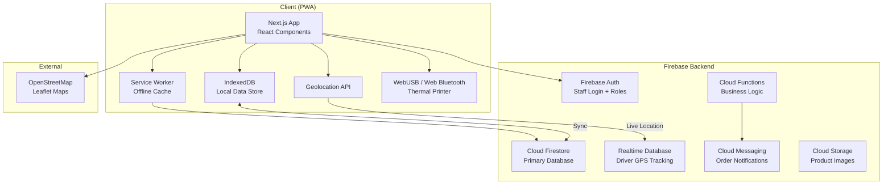
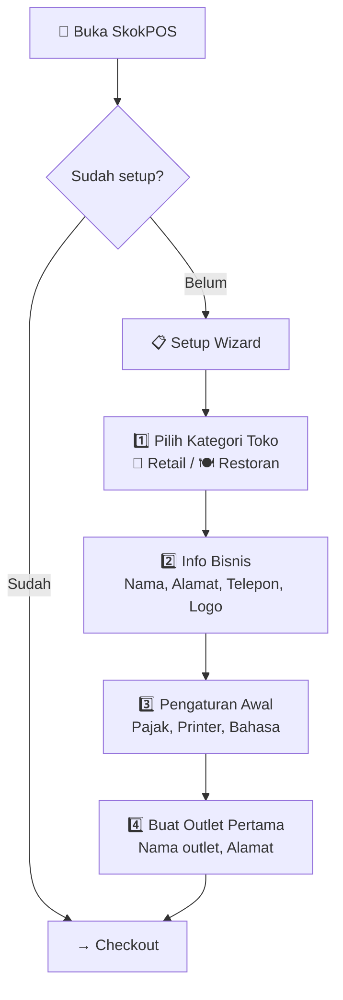

# SkokPOS — Multi-Purpose POS System

A full-featured, offline-first Point of Sales PWA with delivery live tracking, thermal printing, and sales best practices.

## Architecture Overview



## Tech Stack

| Layer | Technology | Rationale |
|---|---|---|
| **Framework** | Next.js 15 (App Router) | SSR, API routes, PWA-ready |
| **UI** | React 19 + **Tailwind CSS v4** | Utility-first, tiny bundle, dark mode built-in |
| **Components** | **Shadcn/ui** | Premium copy-paste components (Dialog, Table, Tabs, Sheet, etc.) |
| **State** | Zustand + React Query | Lightweight, offline-friendly |
| **Database** | Firebase Firestore | Real-time sync, offline persistence |
| **GPS Tracking** | Firebase Realtime DB | Ultra-low latency location updates |
| **Auth** | Firebase Auth | Role-based access (Super Admin/Admin/Cashier/Kitchen/Driver) |
| **Maps** | Leaflet + OpenStreetMap | Free, no API key needed |
| **Charts** | Shadcn/ui Charts (Recharts) | Built-in chart components, consistent styling |
| **Printing** | ESC/POS via WebUSB | Direct thermal printer communication |
| **Offline** | Service Worker + IndexedDB | Full offline-first capability |
| **Currency** | IDR (Indonesian Rupiah) | Default with formatting (Rp 50.000) |
| **Icons** | Lucide React | Modern, consistent icon set (used by Shadcn/ui) |

---

## Decisions (Confirmed)

- ✅ **App Name**: SkokPOS
- ✅ **Firebase Project**: Create new project
- ✅ **Tax Rate**: 12% PPN (configurable)
- ✅ **Receipt Language**: Bahasa Indonesia (adjustable/switchable)
- ✅ **Multi-outlet**: Yes, multi-store support included
- ✅ **Payment Gateway**: Mock for now (Midtrans/Xendit integration later)
- ✅ **Store Mode**: Dynamic — Retail (default) & Restaurant, selectable per outlet

> [!NOTE]
> **Thermal Printer**: WebUSB requires HTTPS or localhost. For testing on Android over WiFi, we'll use ngrok or a self-signed certificate.

> [!NOTE]
> **GPS Tracking**: Initial version tracks driver location while the app is in the foreground.

---

## Dynamic Store Mode System

SkokPOS adapts its features based on the **store category** selected during setup. Each outlet can have its own mode.

### Store Categories

| Mode | Target Business | Examples |
|---|---|---|
| **🛒 Retail** (Default) | Warung, minimarket, toko, retail | Warung Madura, Indomaret-style, toko kelontong |
| **🍽️ Restoran** | Restaurant, café, food court, bakery | Warteg, café, rumah makan, bakery |

### Feature Toggle Matrix

| Feature | 🛒 Retail | 🍽️ Restoran |
|---|:---:|:---:|
| Barcode Scanner | ✅ Primary | ✅ Optional |
| Kategori Produk | ✅ | ✅ |
| Varian Produk (Ukuran/Warna) | ✅ | ✅ |
| **Modifier / Add-on** (Topping, Level Pedas) | ❌ Hidden | ✅ Active |
| **Tipe Order** (Dine-in / Takeaway) | ❌ Hidden | ✅ Active |
| **Nomor Meja** | ❌ Hidden | ✅ Active |
| **Kitchen Display System (KDS)** | ❌ Hidden | ✅ Active |
| **Tiket Dapur (KOT)** | ❌ Hidden | ✅ Active |
| **Peran Dapur (Kitchen Role)** | ❌ Hidden | ✅ Active |
| Delivery & Tracking | ✅ | ✅ |
| Stok / Inventaris | ✅ Unit-based | ✅ + Ingredient-level |
| Pelanggan & Loyalty | ✅ | ✅ |
| Laporan & Analitik | ✅ | ✅ |
| Struk Thermal | ✅ Simple | ✅ + Meja + Tipe Order |
| Sidebar Menu | Standard | + Dapur, + Meja |

### Setup Wizard Flow



### Architecture: How Mode Switching Works

```javascript
// src/stores/settingsStore.js
const STORE_MODES = {
  RETAIL: 'retail',      // Warung, minimarket, toko
  RESTAURANT: 'restaurant' // Restoran, café, rumah makan
};

// Feature flags derived from store mode
const getModeFeatures = (mode) => ({
  hasModifiers: mode === 'restaurant',
  hasTableNumber: mode === 'restaurant',
  hasOrderType: mode === 'restaurant',   // Dine-in / Takeaway
  hasKitchenDisplay: mode === 'restaurant',
  hasKitchenTicket: mode === 'restaurant',
  hasKitchenRole: mode === 'restaurant',
  hasIngredientStock: mode === 'restaurant',
  hasBarcodeScanner: true,  // Both modes
  hasDelivery: true,         // Both modes
  hasLoyalty: true,          // Both modes
});
```

## Proposed Changes

### Phase 1: Project Foundation, Design System & Setup Wizard

#### [NEW] Project Setup
- Initialize Next.js 15 project with App Router
- Configure PWA with `next-pwa` (Service Worker, manifest.json)
- **Install & configure Tailwind CSS v4**
- **Initialize Shadcn/ui** (`npx shadcn@latest init`) with New York style
- Set up Firebase SDK (Auth, Firestore, Realtime DB, **Cloud Storage for logo uploads**)
- Configure offline persistence
- **Set up i18n (multi-language) system**

#### [NEW] `src/lib/i18n/` — Internationalization System
Lightweight JSON-based translation system (no heavy library needed):

- `config.js` — Language config, default locale, supported locales
- `id.json` — 🇮🇩 Bahasa Indonesia translations (default)
- `en.json` — 🇬🇧 English translations
- `useTranslation.js` — React hook: `const { t } = useTranslation()`
- `LanguageContext.jsx` — React Context provider for active language
- `formatters.js` — Locale-aware number, currency, and date formatting

**Supported Languages:**

| Code | Language | Status |
|---|---|---|
| `id` | 🇮🇩 Bahasa Indonesia | Default |
| `en` | 🇬🇧 English | Supported |

**What Gets Translated:**

| Surface | Examples |
|---|---|
| 📱 UI Labels | Menu, buttons, headings, placeholders, tooltips |
| 🧱 Receipts | Header, footer, item labels, payment labels |
| 📊 Reports | Chart titles, export headers, date formats |
| 🔔 Notifications | Low stock alerts, order updates, errors |
| ⚠️ Error Messages | Validation errors, connection issues |
| 📅 Date/Time | "3 Juni 2026" vs "June 3, 2026" |
| 💰 Currency | "Rp 50.000" (both locales, IDR stays as IDR) |
| 📦 PO & Inventory | Status labels, vendor forms, stock opname |

**Translation Sample:**

```json
// src/lib/i18n/id.json (Bahasa Indonesia)
{
  "common": {
    "save": "Simpan",
    "cancel": "Batal",
    "delete": "Hapus",
    "edit": "Ubah",
    "search": "Cari...",
    "back": "Kembali",
    "confirm": "Konfirmasi",
    "loading": "Memuat..."
  },
  "nav": {
    "checkout": "Kasir",
    "delivery": "Pengiriman",
    "kitchen": "Dapur",
    "inventory": "Inventaris",
    "vendors": "Vendor",
    "purchaseOrders": "Pesanan Pembelian",
    "stockOpname": "Stok Opname",
    "reports": "Laporan",
    "staff": "Karyawan",
    "customers": "Pelanggan",
    "settings": "Pengaturan"
  },
  "checkout": {
    "cart": "Keranjang",
    "subtotal": "Subtotal",
    "discount": "Diskon",
    "tax": "PPN",
    "total": "Total",
    "pay": "Bayar",
    "cash": "Tunai",
    "card": "Kartu",
    "ewallet": "E-Wallet",
    "change": "Kembalian",
    "holdOrder": "Tahan Pesanan",
    "recallOrder": "Ambil Pesanan",
    "dineIn": "Makan di Tempat",
    "takeaway": "Bawa Pulang",
    "tableNumber": "Nomor Meja"
  },
  "inventory": {
    "stock": "Stok",
    "lowStock": "Stok Rendah",
    "outOfStock": "Habis",
    "minStock": "Stok Minimum",
    "adjustment": "Penyesuaian",
    "reorder": "Perlu Restock"
  },
  "po": {
    "draft": "Draft",
    "sent": "Dikirim",
    "received": "Diterima",
    "partial": "Sebagian",
    "cancelled": "Dibatalkan",
    "createPO": "Buat Pesanan Pembelian",
    "sendViaWA": "Kirim via WhatsApp",
    "receiveGoods": "Terima Barang"
  },
  "receipt": {
    "thankYou": "Terima Kasih!",
    "noReturn": "Barang yang sudah dibeli tidak dapat dikembalikan",
    "cashier": "Kasir",
    "outlet": "Outlet",
    "orderType": "Tipe",
    "table": "Meja"
  }
}
```

```json
// src/lib/i18n/en.json (English)
{
  "common": {
    "save": "Save",
    "cancel": "Cancel",
    "delete": "Delete",
    "edit": "Edit",
    "search": "Search...",
    "back": "Back",
    "confirm": "Confirm",
    "loading": "Loading..."
  },
  "nav": {
    "checkout": "Checkout",
    "delivery": "Delivery",
    "kitchen": "Kitchen",
    "inventory": "Inventory",
    "vendors": "Vendors",
    "purchaseOrders": "Purchase Orders",
    "stockOpname": "Stock Count",
    "reports": "Reports",
    "staff": "Staff",
    "customers": "Customers",
    "settings": "Settings"
  },
  "checkout": {
    "cart": "Cart",
    "subtotal": "Subtotal",
    "discount": "Discount",
    "tax": "Tax",
    "total": "Total",
    "pay": "Pay",
    "cash": "Cash",
    "card": "Card",
    "ewallet": "E-Wallet",
    "change": "Change",
    "holdOrder": "Hold Order",
    "recallOrder": "Recall Order",
    "dineIn": "Dine In",
    "takeaway": "Takeaway",
    "tableNumber": "Table Number"
  }
}
```

**Usage in Components:**
```jsx
function CartPanel() {
  const { t } = useTranslation();
  return (
    <div>
      <h2>{t('checkout.cart')}</h2>        {/* "Keranjang" or "Cart" */}
      <span>{t('checkout.subtotal')}</span> {/* "Subtotal" */}
      <button>{t('checkout.pay')}</button>  {/* "Bayar" or "Pay" */}
    </div>
  );
}
```

**Language Switching:**
- Selected during **Setup Wizard** (Step 3: Pengaturan Awal)
- Changeable anytime in **Settings** (all roles can change)
- Instant switch — no page reload needed
- Saved per user preference in local storage

#### [NEW] `src/styles/globals.css` — Design System (Tailwind CSS v4)
Tailwind-based design system with CSS custom properties for theming:
- **CSS Variables**: HSL color tokens for light/dark themes via `@theme`
- **Color Palette**: Professional indigo-blue primary, warm accents, semantic colors
- **Typography**: Inter font from Google Fonts via `@import`
- **Dark Mode**: `class` strategy — toggle via `dark:` prefix
- **Animations**: Custom keyframes for skeleton loading, slide-in, fade, pulse
- **Responsive**: Mobile-first with Tailwind breakpoints (`sm:`, `md:`, `lg:`, `xl:`)

#### [NEW] Shadcn/ui Components to Install
Pre-built, accessible, customizable components — installed on-demand:

| Component | POS Usage |
|---|---|
| `Button` | All action buttons, payment, confirm, cancel |
| `Dialog` | Payment modal, discount modal, confirmations |
| `Sheet / Drawer` | Held orders drawer, mobile cart panel |
| `Table` | Inventory, vendor list, staff, PO items, stock opname |
| `Tabs` | Product categories, PO status, report periods |
| `Select / Combobox` | Vendor picker, driver assignment, outlet selector |
| `Badge` | Order status, stock alerts, role badges |
| `Toast / Sonner` | Success/error notifications, low stock alerts |
| `Command` | Quick product search (⌘K style) |
| `Calendar + DatePicker` | Report date range, PO dates |
| `Chart` | Revenue, category sales, payment distribution |
| `Card` | Product cards, dashboard stat cards, order cards |
| `Input` | Search, barcode input, forms |
| `Label` | Form labels |
| `Dropdown Menu` | Action menus, user menu |
| `Avatar` | Staff avatar in header |
| `Separator` | Visual dividers |
| `Skeleton` | Loading states |
| `Switch` | Toggle settings (dark mode, tax inclusive) |
| `Tooltip` | Icon button hints |

#### [NEW] `src/app/setup/page.jsx` — Setup Wizard (First-Time Only)
Multi-step onboarding wizard shown on first launch:
- **Step 1 — Kategori Toko**: Choose 🛒 Retail or 🍽️ Restoran (visual cards with icons & descriptions)
- **Step 2 — Info Bisnis**: Store name, address, phone number, **logo upload**
  - Drag-and-drop or click-to-browse image upload
  - Image preview with crop & resize (max 512x512px)
  - Supports PNG, JPG, SVG formats
  - Stored in Firebase Cloud Storage (`stores/{storeId}/logo`)
  - Optional — uses default SkokPOS icon if skipped
- **Step 3 — Pengaturan Awal**: Tax rate (12% default), currency, language, printer setup
- **Step 4 — Outlet Pertama**: Create first outlet with name, address, and **optional outlet-specific logo**
- Saves config to Firestore + local storage, then redirects to `/checkout`
- Includes sample product data seeding based on chosen mode:
  - **Retail**: Indomie, Aqua, Beras, Minyak Goreng, Sabun, etc.
  - **Restoran**: Nasi Goreng, Mie Ayam, Es Teh, Kopi Susu, etc.

**🖼️ Where the Logo Appears:**

| Location | Description |
|---|---|
| 🧱 Struk / Receipt | Printed at top of thermal receipt (converted to ESC/POS bitmap) |
| 📋 Sidebar | Displayed above store name in the navigation sidebar |
| 🔐 Login / PIN Screen | Centered logo on staff login and PIN entry screen |
| 🚚 Customer Tracking | Shown on the public delivery tracking page |
| 📊 Reports Header | Displayed on exported PDF reports |

#### [NEW] `src/components/ui/LogoUpload.jsx` — Reusable Logo Upload Component
- Drag-and-drop zone with click fallback
- Real-time image preview (circular crop)
- Client-side resize to 512x512px before upload (saves bandwidth)
- Upload progress indicator
- Remove/replace logo button
- Used in: Setup Wizard (Step 2), Settings (Business Info), Outlet Management

#### [NEW] `src/components/layout/` — App Shell
- `Sidebar.jsx` — Collapsible navigation with **mode-aware menu items** (Kitchen & Table links hidden in Retail mode)
- `Header.jsx` — Search, notifications bell, user avatar, dark mode toggle, **active outlet selector**
- `MobileNav.jsx` — Bottom tab navigation for phone screens
- `AppShell.jsx` — Responsive layout wrapper (sidebar on desktop, bottom nav on mobile)

#### [NEW] `src/lib/storeMode.js` — Store Mode Engine
- `STORE_MODES` enum (retail, restaurant)
- `getModeFeatures(mode)` — Returns feature flags for the active mode
- `useModeFeatures()` — React hook to access feature flags in components
- Conditionally renders/hides UI elements based on mode

---

### Phase 2: Product Catalog & Checkout (Core POS)

#### [NEW] `src/stores/` — State Management (Zustand)
- `cartStore.js` — Cart state (items, quantities, discounts, tax, total)
- `productStore.js` — Product catalog with search/filter
- `authStore.js` — User session and role
- `settingsStore.js` — App settings (tax rate, currency, printer config, **storeMode**, active outlet)
- `shiftStore.js` — **🆕** Shift management state (open/close, starting cash, transactions)

#### [NEW] `src/app/(pos)/checkout/page.jsx` — Main POS Screen
The heart of the app — split-screen layout:
- **Left panel (70%)**: Product grid with categories, search bar, and barcode scanner input
- **Right panel (30%)**: Cart with running total, discount controls, and payment buttons
- Product cards with image, name, price, and quick-add
- Category tabs with horizontal scrolling
- Real-time search with debounce
- Quantity adjustment (+/−) in cart
- Hold order / Recall order functionality
- **🆕 Open Price / Custom Item**: Add item not in catalog with manual name & price
- **🆕 Weight-based input**: Products sold per-kg show weight input (e.g., 2.5 kg)
- **🆕 Multi-Price**: Auto-apply wholesale price when qty meets threshold
- **🆕 Bon/Hutang**: "Bayar Nanti" button for credit sales to known customers
- **🍽️ Restaurant only**: Order type toggle (Dine-in / Takeaway), table number input, modifier selection on product add

#### [NEW] `src/app/(pos)/checkout/components/`
- `ProductGrid.jsx` — Responsive product grid with category filtering
- `ProductCard.jsx` — Individual product card with variant/modifier support
- `CartPanel.jsx` — Shopping cart with line items
- `CartItem.jsx` — Single cart item with qty controls
- `PaymentModal.jsx` — Payment method selection and processing
- `DiscountModal.jsx` — Apply percentage or fixed discount
- `HeldOrdersDrawer.jsx` — View and recall held orders
- `BarcodeInput.jsx` — Invisible input field for barcode scanner
- `OpenPriceModal.jsx` — **🆕** Manual item entry (name + price) for uncatalogued items
- `WeightInput.jsx` — **🆕** Numeric weight input with kg unit for weight-based products
- `CreditSaleModal.jsx` — **🆕** Select customer → confirm bon/hutang sale
- `OrderTypeSelector.jsx` — **🍽️ Restaurant only**: Dine-in / Takeaway toggle
- `TableSelector.jsx` — **🍽️ Restaurant only**: Table number picker
- `ModifierPicker.jsx` — **🍽️ Restaurant only**: Add-on/topping selection modal

#### [NEW] `src/app/(pos)/shift/` — Shift Management (Buka/Tutup Kasir)
- **Buka Shift**:
  - Kasir input modal awal (starting cash)
  - Record start time, kasir name
  - Must open shift before first transaction
- **Selama Shift**:
  - Track all transactions (sales, refunds, voids)
  - Running cash balance = starting cash + cash sales − cash refunds
- **Tutup Shift**:
  - Input actual cash count (per denomination: Rp 100.000, 50.000, 20.000, etc.)
  - System vs actual comparison with variance
  - Add notes for discrepancies
  - Print shift summary on thermal printer
- **Serah Terima**: Transfer shift to another kasir without closing store
- **Shift History**: View past shifts with all details

#### [NEW] `src/app/(pos)/returns/page.jsx` — Retur, Refund & Void
- **Void Transaksi**: Cancel a recently completed transaction (requires Super Admin/Admin PIN approval)
- **Retur Barang**:
  - Search order by number or scan receipt barcode
  - Select items to return (partial or full)
  - Choose refund method: cash back, store credit, or exchange
  - Auto-update inventory (returned stock added back)
- **Retur Sebagian**: Return 1 of 5 items from an order
- **Log Retur**: Complete history of all returns/voids with reason and approver
- **Void time limit**: Configurable (e.g., void only within 15 minutes of sale)

#### [NEW] `src/lib/firebase/` — Firebase Configuration
- `config.js` — Firebase app initialization
- `firestore.js` — Firestore helpers with offline persistence
- `auth.js` — Authentication helpers
- `realtime.js` — Realtime Database for GPS tracking

#### [NEW] `src/lib/models/` — Data Models
```
Store:         { id, name, address, phone, logo, storeMode, taxRate, taxInclusive, language, createdAt }
Outlet:        { id, storeId, name, address, storeMode, modules, isActive }
Product:       { id, name, sku, barcode, categoryId, price, cost, wholesalePrice, wholesaleMinQty, unit, soldByWeight, expiryDate, image, variants[], modifiers[], isActive, stock, minStock, outletId, vendorId }
Order:         { id, orderNumber, items[], subtotal, discount, tax, total, paymentMethod, status, cashierId, customerId, outletId, orderType, tableNumber, shiftId, isCredit, createdAt }
Category:      { id, name, icon, color, sortOrder }
Modifier:      { id, name, price, group, isRequired }  // 🍽️ Restaurant only
Vendor:        { id, name, contactPerson, phone, email, address, notes, products[], isActive, outletId, createdAt }
PurchaseOrder: { id, poNumber, vendorId, outletId, items[], status, subtotal, tax, total, notes, createdBy, createdAt, sentAt, receivedAt }
POItem:        { productId, productName, qty, qtyReceived, unitPrice, subtotal }
StockOpname:   { id, outletId, items[], status, countedBy, approvedBy, createdAt, completedAt }
Shift:         { id, outletId, cashierId, startingCash, actualCash, expectedCash, variance, status, startedAt, closedAt, notes }
Return:        { id, orderId, items[], refundAmount, refundMethod, reason, approvedBy, createdBy, createdAt }
Credit:        { id, customerId, orderId, amount, paidAmount, remainingAmount, status, dueDate, outletId, createdAt }
ActivityLog:   { id, userId, action, target, details, outletId, timestamp }
```

---

### Phase 3: Thermal Printing

#### [NEW] `src/lib/printer/`
- `escpos.js` — ESC/POS command builder (text formatting, alignment, barcode, QR code, cut paper)
- `usbPrinter.js` — WebUSB connection manager (discover, connect, print)
- `bluetoothPrinter.js` — Web Bluetooth fallback for wireless printers
- `receiptTemplate.js` — Receipt layout builder (mode-aware):

  **🛒 Retail Receipt:**
  ```
  ================================
          SKOKPOS
       Jl. Contoh No. 123
        Tel: 021-1234567
  ================================
  Kasir: Ahmad    03/06/2026 14:30
  No: INV-20260603-0001
  Outlet: Cabang Utama
  --------------------------------
  Indomie Goreng   x5  Rp  17.500
  Aqua 600ml       x3  Rp  12.000
  --------------------------------
  Subtotal:           Rp  29.500
  PPN (12%):          Rp   3.540
  ================================
  TOTAL:              Rp  33.040
  ================================
  Bayar (Tunai):      Rp  50.000
  Kembali:            Rp  16.960
  --------------------------------
       Terima Kasih!
  ================================
  ```

  **🍽️ Restaurant Receipt:**
  ```
  ================================
          SKOKPOS
       Jl. Contoh No. 123
        Tel: 021-1234567
  ================================
  Kasir: Ahmad    03/06/2026 14:30
  No: INV-20260603-0001
  Outlet: Cabang Utama
  Tipe: Dine-in | Meja: 5
  --------------------------------
  Nasi Goreng Spesial x2 Rp 50.000
    + Telur Ceplok     x2 Rp  6.000
    + Level Pedas 3
  Es Teh Manis        x3 Rp 30.000
  --------------------------------
  Subtotal:           Rp  86.000
  Diskon (10%):      -Rp   8.600
  PPN (12%):          Rp   9.288
  ================================
  TOTAL:              Rp  86.688
  ================================
  Bayar (Tunai):      Rp 100.000
  Kembali:            Rp  13.312
  --------------------------------
       Terima Kasih!
   Barang yang sudah dibeli
    tidak dapat dikembalikan
  ================================
  ```
- `kitchenTicket.js` — **🍽️ Restaurant only**: KOT/BOT template (order items with modifiers, large font, table number)

#### [NEW] `src/components/printer/`
- `PrinterSetup.jsx` — Printer discovery and pairing UI
- `PrintPreview.jsx` — On-screen receipt preview before printing
- `PrinterStatus.jsx` — Connection indicator in header

#### [NEW] Struk Digital via WhatsApp
- After payment, option: "Kirim struk ke WhatsApp?"
- Opens WhatsApp with pre-formatted receipt text (wa.me API)
- Includes: order number, items, total, payment method, store info
- Alternative: generate receipt as image and share

#### [NEW] Cetak Label Barcode
- Generate barcode (Code128/EAN13) for products without barcode
- Print barcode sticker labels on thermal printer
- Label includes: product name, price, barcode
- Batch print: select multiple products → print all labels at once
- Custom label size: 40×30mm, 50×25mm, 60×40mm

---

### Phase 4: Delivery Management & Live Tracking

#### [NEW] `src/app/(pos)/delivery/page.jsx` — Delivery Dashboard
- Kanban board layout: New → Preparing → Picked Up → En Route → Delivered
- Drag-and-drop order cards between columns
- Assign/reassign drivers to orders
- Real-time map showing all active drivers
- ETA calculations

#### [NEW] `src/app/(pos)/delivery/components/`
- `DeliveryBoard.jsx` — Kanban columns with order cards
- `OrderCard.jsx` — Order summary card with status badge
- `DriverAssignment.jsx` — Driver selection dropdown
- `LiveMap.jsx` — Leaflet map with driver markers and delivery routes
- `DeliveryTimeline.jsx` — Status history timeline

#### [NEW] `src/app/track/[orderId]/page.jsx` — Customer Tracking Page
- Public page (no auth required)
- Live map with animated driver marker
- Order details and status
- ETA with progress bar
- Delivery person name and contact
- Auto-refresh via Realtime Database listener

#### [NEW] `src/app/(driver)/driver/page.jsx` — Driver Mobile View
- Optimized for phone screens
- Current delivery with navigation
- Order list queue
- Status update buttons (one-tap: "Picked Up", "En Route", "Delivered")
- GPS broadcasting (sends location every 5 seconds to Realtime DB)

#### [NEW] `src/lib/tracking/`
- `gpsTracker.js` — Geolocation API wrapper with battery-efficient polling
- `locationSync.js` — Push GPS coordinates to Firebase Realtime DB
- `etaCalculator.js` — Simple distance-based ETA estimation

---

### Phase 5: Inventory, Reports, Staff & Customers

#### [NEW] `src/app/(admin)/inventory/page.jsx` — Inventory Management
- Stock levels table with search and filters
- Low stock alerts (visual badges + notification)
- Stock adjustment (in/out with reason)
- Stock history log (full audit trail)
- Bulk import/export (CSV)
- **Min stock threshold** per product (triggers smart reorder)
- **🆕 Tanggal Kadaluarsa (Expiry Date)**:
  - Input expiry date per product batch
  - Alert: produk mendekati kadaluarsa (7 hari, 30 hari sebelum)
  - Color-coded: 🟢 OK | 🟡 Mendekati kadaluarsa | 🔴 Sudah kadaluarsa
  - FIFO enforcement: produk kadaluarsa terdekat dijual duluan
  - Report: daftar produk kadaluarsa untuk write-off
- **🆕 Produk Timbangan (Weight-based)**:
  - Per product: toggle "Jual per satuan" vs "Jual per kg"
  - Input berat di checkout: 2.5 kg × Rp 15.000 = Rp 37.500
  - Support unit: kg, gram, liter, meter
- **🆕 Harga Grosir / Multi-Price**:
  - Per product: set harga satuan + harga grosir + minimum qty grosir
  - Example: Indomie Rp 3.500/pcs, Rp 3.000/pcs jika beli ≥ 40 pcs
  - Auto-switch price at checkout when qty threshold met
  - Optional: harga per tier pelanggan (Regular/Silver/Gold/Platinum)

#### [NEW] `src/app/(admin)/vendors/page.jsx` — Vendor / Supplier Management
- Vendor list with search, filter by status (active/inactive)
- Add/edit vendor: name, contact person, phone, email, address, notes
- **Link products to vendor** — which vendor supplies which products
- Vendor performance: total purchases, last order date, average delivery time
- Purchase history per vendor
- Quick action: "Buat PO" (create Purchase Order) from vendor page

#### [NEW] `src/app/(admin)/purchase-orders/page.jsx` — Purchase Orders (PO)
- PO list with status tabs: Semua | Draft | Dikirim | Diterima | Dibatalkan
- **Create PO**:
  - Select vendor → auto-populate vendor’s products
  - Add items with qty and unit price
  - Auto-calculate subtotal & total
  - Add notes/catatan
  - PO number format: `PO-YYYYMMDD-NNNN`
- **PO Status Flow**:
  ```
  Draft → Dikirim → Diterima (Sebagian/Penuh) → Selesai
                → Dibatalkan
  ```
- **Send PO to vendor**:
  - Share via WhatsApp (formatted text message)
  - Export as PDF (with store logo)
  - Copy link
- **Receive goods** — opens Goods Receiving flow

#### [NEW] `src/app/(admin)/purchase-orders/receive/[poId]/page.jsx` — Goods Receiving
- View PO items with expected qty
- Input actual received qty per item
- Mark items: Diterima Penuh | Diterima Sebagian | Tidak Diterima
- **Auto-update inventory** on confirm
- Option to create new PO for remaining items (partial delivery)
- Print receiving slip on thermal printer

#### [NEW] `src/app/(admin)/stock-opname/page.jsx` — Stock Opname (Physical Count)
- Start new stock opname session
- Scan barcode or search product → input physical count
- **System vs Physical comparison** with variance column
- Color-coded: 🟢 Match | 🟡 Minor difference | 🔴 Major difference
- Approve adjustments (Super Admin / Admin only)
- Auto-generate adjustment log with reason "Stock Opname"
- History of past opname sessions

#### [NEW] Smart Reorder System
- Dashboard widget: "Produk Perlu Restock" (Products Need Restock)
- When `stock <= minStock` → product appears in alert list
- One-click: "Buat PO Otomatis" → generates draft PO grouped by vendor
- Suggested qty = `(minStock * 2) - currentStock` (configurable multiplier)
- Notification push for low stock alerts

#### [NEW] `src/app/(admin)/reports/page.jsx` — Reports & Analytics
Comprehensive reporting suite with date range picker and export options:

**📊 Dashboard / Ringkasan Harian:**
- Revenue today vs yesterday (% change)
- Order count, average order value
- Top 5 products, low stock count, pending POs

**💰 Laporan Penjualan (Sales):**
- Penjualan harian / mingguan / bulanan (line chart)
- Penjualan per produk (best sellers table)
- Penjualan per kategori (donut chart)
- Penjualan per outlet (comparison)
- Penjualan per kasir (staff performance)
- Penjualan per jam (hourly heatmap — identify peak hours)
- Penjualan per metode bayar (cash vs card vs e-wallet)
- Penjualan per tipe order (🍽️ dine-in vs takeaway vs delivery)
- Trend penjualan (weekly/monthly trend)

**📦 Laporan Inventaris (Inventory):**
- Stok saat ini (all products with current level)
- Stok rendah & habis (below threshold)
- Pergerakan stok (in/out history per product)
- Nilai inventaris (total value = stock × cost price)
- Stok opname history (past sessions & variances)

**🏦 Laporan Pembelian (Purchase):**
- Pembelian per vendor (spending breakdown)
- Riwayat PO (all purchase orders with status)
- Harga beli trend (cost price changes over time)
- Vendor performance (delivery time, fulfillment rate)

**👥 Laporan Pelanggan (Customer):**
- Pelanggan terbanyak (top spenders)
- Pelanggan baru per periode
- Loyalty points summary (earned/redeemed)
- Frekuensi kunjungan

**👨‍💼 Laporan Karyawan (Staff):**
- Penjualan per kasir
- Jumlah transaksi per kasir
- Driver performance (🚚 deliveries count, avg time)

**🚚 Laporan Pengiriman (Delivery):**
- Delivery per hari (count & revenue)
- Delivery per driver
- Rata-rata waktu kirim

**💸 Laporan Keuangan Sederhana:**
- Profit & Loss sederhana (revenue − cost = gross profit)
- Pajak terkumpul (PPN collected per period)
- Diskon diberikan (total discounts)
- Ringkasan kas (cash in register, open/close shift)

**📤 Export Formats:**
- PDF (with store logo)
- CSV / Excel
- Share via WhatsApp (daily summary)
- Thermal print (end-of-day summary on receipt printer)

**🆕 Laporan Shift (Shift Reports):**
- Ringkasan per shift: penjualan, refund, void, kas masuk/keluar
- Selisih kas (expected vs actual)
- Riwayat shift per kasir

**🆕 Laporan Retur & Void:**
- Daftar semua retur dan void dengan alasan
- Total nilai refund per periode
- Produk paling sering di-retur

**🆕 Laporan Hutang (Credit/Bon):**
- Total piutang outstanding
- Hutang per pelanggan
- Hutang jatuh tempo
- Pembayaran hutang per periode

**🆕 Laporan Kadaluarsa:**
- Produk mendekati kadaluarsa (7/30 hari)
- Produk sudah kadaluarsa (perlu write-off)
- Nilai kerugian produk kadaluarsa

#### [NEW] Laporan Otomatis / Scheduled Reports
- **Laporan Harian Otomatis**: Auto-kirim ringkasan ke WhatsApp owner jam 22:00
- **Laporan Mingguan**: Ringkasan mingguan tiap Senin pagi
- **Konfigurasi**: Super Admin pilih laporan mana yang dikirim otomatis
- **Format**: Teks ringkas via WhatsApp API (wa.me)

#### [NEW] `src/app/(admin)/activity-log/page.jsx` — Activity Log / Audit Trail
- Log semua aktivitas: edit produk, hapus pesanan, ubah harga, void, retur, login/logout, perubahan settings
- Filter: per user, per tipe aksi, per tanggal
- **Immutable**: Log tidak bisa dihapus atau diedit oleh siapapun
- Detail: siapa, apa, kapan, dari nilai apa ke nilai apa
- Export ke CSV untuk audit
- Hanya bisa dilihat oleh Super Admin & Admin

#### [NEW] `src/app/(pos)/credit/page.jsx` — Bon / Hutang (Credit Sales)
- **Daftar Piutang**: Semua hutang pelanggan yang belum lunas
- **Buat Hutang**: Saat checkout, pilih "Bayar Nanti" → linked ke pelanggan
- **Bayar Hutang**: Pelanggan bayar sebagian atau lunas
- **Batas Kredit**: Set limit hutang per pelanggan (configurable by Super Admin)
- **Jatuh Tempo**: Set tanggal jatuh tempo per transaksi hutang
- **Reminder**: Notifikasi hutang mendekati/melewati jatuh tempo
- **Status**: Belum Bayar → Bayar Sebagian → Lunas
- **Riwayat**: Riwayat pembayaran hutang per pelanggan

#### [NEW] `src/app/(admin)/staff/page.jsx` — Staff Management
- Staff list with roles and status
- Add/edit staff with role assignment
- Role-based access control (5 roles):
  - **🔑 Super Admin**: Full access — store mode, outlet management, tax settings, staff roles, data reset. Created automatically during Setup Wizard.
  - **👔 Admin**: Reports, inventory, customers, staff list (cannot change store mode, outlets, or tax)
  - **💳 Kasir (Cashier)**: POS checkout, order management, customer lookup
  - **🍳 Dapur (Kitchen)**: Kitchen display, order status updates (🍽️ Restaurant only)
  - **🚚 Driver**: Delivery view, GPS tracking
- PIN-based quick login (for shift changes at POS terminal)
- Only Super Admin can assign/change roles

**Role Permission Matrix**:

| Feature | 🔑 Super Admin | 👔 Admin | 💳 Kasir | 🍳 Dapur | 🚚 Driver |
|---|:---:|:---:|:---:|:---:|:---:|
| Ganti kategori toko | ✅ | ❌ | ❌ | ❌ | ❌ |
| Kelola outlet | ✅ | ❌ | ❌ | ❌ | ❌ |
| Ubah tarif pajak | ✅ | ❌ | ❌ | ❌ | ❌ |
| Kelola staff & roles | ✅ | ❌ | ❌ | ❌ | ❌ |
| Hapus data / reset | ✅ | ❌ | ❌ | ❌ | ❌ |
| Backup / restore | ✅ | ❌ | ❌ | ❌ | ❌ |
| Lihat laporan | ✅ | ✅ | ❌ | ❌ | ❌ |
| Kelola inventaris | ✅ | ✅ | ❌ | ❌ | ❌ |
| **Kelola vendor** | ✅ | ✅ | ❌ | ❌ | ❌ |
| **Buat & kelola PO** | ✅ | ✅ | ❌ | ❌ | ❌ |
| **Terima barang (receiving)** | ✅ | ✅ | ❌ | ❌ | ❌ |
| **Stock opname** | ✅ | ✅ | ❌ | ❌ | ❌ |
| Kelola pelanggan | ✅ | ✅ | ✅ | ❌ | ❌ |
| Checkout / POS | ✅ | ❌ | ✅ | ❌ | ❌ |
| Kitchen Display | ✅ | ❌ | ❌ | ✅ | ❌ |
| Delivery Board | ✅ | ✅ | ✅ | ❌ | ❌ |
| Driver View | ❌ | ❌ | ❌ | ❌ | ✅ |
| Printer & receipt settings | ✅ | ✅ | ❌ | ❌ | ❌ |
| Theme & language | ✅ | ✅ | ✅ | ✅ | ✅ |

#### [NEW] `src/app/(admin)/customers/page.jsx` — Customer Database
- Customer list with search
- Purchase history per customer
- Loyalty points system (earn points per purchase, redeem for discounts)
- Customer groups/tiers (Regular, Silver, Gold, Platinum)

#### [NEW] `src/app/(pos)/kitchen/page.jsx` — Kitchen Display System (KDS)
- Full-screen order queue
- Color-coded by priority/wait time (green → yellow → red)
- One-tap "Done" to mark items as prepared
- Audio notification for new orders
- Auto-dismiss completed orders after 30 seconds

---

### Phase 6: Settings & Configuration

#### [NEW] `src/app/(admin)/settings/page.jsx` — Settings Page
- **🔒 Super Admin Only**:
  - Kategori Toko: Switch between 🛒 Retail and 🍽️ Restoran mode (per outlet)
  - Outlet Management: Add/edit/switch outlets, set mode per outlet
  - Tax Settings: Rate, inclusive/exclusive toggle
  - Backup/Restore: Export/import data
  - **🔧 Kelola Modul (Module Visibility)**: Show/hide modules per outlet
- **👔 Admin + Super Admin**:
  - Business Info: Store name, address, phone, logo
  - Receipt Settings: Header, footer, custom text
  - Printer Settings: Connection type, test print
  - Notification Settings: Sound, desktop notifications
- **🔓 All Roles**:
  - Theme: Light/Dark mode, accent color
  - Language: Bahasa Indonesia / English switch

#### [NEW] Module Visibility Management (🔑 Super Admin Only)
Super Admin can show/hide entire modules to simplify the UI for their business needs.
Config is saved **per outlet** in Firestore.

**Toggleable Modules:**

| Module | Default (🛒 Retail) | Default (🍽️ Restoran) | What Happens When Hidden |
|---|:---:|:---:|---|
| 🚚 **Pengiriman (Delivery)** | ✅ On | ✅ On | Delivery menu, driver view, tracking removed |
| 🏦 **Vendor / Supplier** | ✅ On | ✅ On | Vendor page hidden from sidebar |
| 📝 **Pesanan Pembelian (PO)** | ✅ On | ✅ On | PO & receiving pages hidden |
| 📋 **Stok Opname** | ✅ On | ✅ On | Stock count page hidden |
| 👥 **Pelanggan & Loyalty** | ✅ On | ✅ On | Customer page hidden, loyalty disabled |
| 🍳 **Dapur / KDS** | ❌ Off | ✅ On | Kitchen display & KOT printing hidden |
| 🍽️ **Meja / Table** | ❌ Off | ✅ On | Table number input hidden from checkout |
| 🌟 **Modifier / Add-on** | ❌ Off | ✅ On | Modifier picker hidden from checkout |
| 📊 **Laporan Lanjutan** | ✅ On | ✅ On | Advanced reports hidden (keeps dashboard) |
| 🔔 **Smart Reorder** | ✅ On | ✅ On | Auto-reorder suggestions disabled |

**How it works:**
```javascript
// src/stores/settingsStore.js
const moduleVisibility = {
  delivery: true,
  vendors: true,
  purchaseOrders: true,
  stockOpname: true,
  customers: true,
  kitchen: false,      // Auto-set by store mode
  tables: false,       // Auto-set by store mode
  modifiers: false,    // Auto-set by store mode
  advancedReports: true,
  smartReorder: true,
};
```

**UI in Settings:**
```
┌─────────────────────────────────────────┐
│  🔧 Kelola Modul                        │
│                                         │
│  Pilih modul yang aktif untuk outlet ini │
│                                         │
│  🚚 Pengiriman          [█████] ON     │
│  🏦 Vendor / Supplier   [█████] ON     │
│  📝 Pesanan Pembelian   [█████] ON     │
│  📋 Stok Opname         [█████] ON     │
│  👥 Pelanggan & Loyalty [█████] ON     │
│  🍳 Dapur / KDS         [─────] OFF    │
│  🍽️ Meja / Table        [─────] OFF    │
│  🌟 Modifier / Add-on   [─────] OFF    │
│  📊 Laporan Lanjutan    [█████] ON     │
│  🔔 Smart Reorder       [█████] ON     │
│                                         │
│  ⚠️ Beberapa modul otomatis aktif        │
│  berdasarkan kategori toko               │
│                                         │
│         [ Simpan Pengaturan ]            │
└─────────────────────────────────────────┘
```

**Behavior:**
- Hidden modules are **removed from sidebar** navigation
- Hidden module pages return **redirect to /checkout** if accessed directly
- When store mode changes (Retail → Restoran), restaurant modules auto-enable but Super Admin can still turn them off
- **Checkout** and **Settings** cannot be hidden (always required)
- Module visibility is stored in Firestore under `outlets/{outletId}/modules`

---

## Project File Structure

```
skokpos/
├── public/
│   ├── manifest.json          # PWA manifest
│   ├── sw.js                  # Service Worker
│   ├── icons/                 # App icons (192px, 512px)
│   └── sounds/                # Notification sounds
├── src/
│   ├── app/
│   │   ├── globals.css        # Tailwind base + CSS variables (light/dark)
│   │   ├── layout.jsx         # Root layout with AppShell
│   │   ├── page.jsx           # Landing → redirect to /checkout or /setup
│   │   ├── setup/             # 🆕 First-time setup wizard
│   │   ├── (pos)/
│   │   │   ├── checkout/      # Main POS checkout (mode-aware)
│   │   │   ├── shift/         # 🆕 Shift management (open/close kasir)
│   │   │   ├── returns/       # 🆕 Return, refund & void
│   │   │   ├── credit/        # 🆕 Bon/hutang management
│   │   │   ├── delivery/      # Delivery management
│   │   │   └── kitchen/       # 🍽️ Kitchen Display System (restaurant only)
│   │   ├── (admin)/
│   │   │   ├── inventory/     # Inventory management + expiry tracking
│   │   │   ├── vendors/       # 🆕 Vendor/supplier management
│   │   │   ├── purchase-orders/ # 🆕 Purchase orders + goods receiving
│   │   │   ├── stock-opname/  # 🆕 Physical stock count
│   │   │   ├── reports/       # Analytics dashboard + scheduled reports
│   │   │   ├── activity-log/  # 🆕 Audit trail / activity log
│   │   │   ├── staff/         # Staff management
│   │   │   ├── customers/     # Customer database
│   │   │   └── settings/      # App settings + module visibility
│   │   ├── (driver)/
│   │   │   └── driver/        # Driver mobile view
│   │   └── track/
│   │       └── [orderId]/     # Public tracking page
│   ├── components/
│   │   ├── ui/                # 🆕 Shadcn/ui components (Button, Dialog, Table, etc.)
│   │   ├── layout/            # AppShell, Sidebar, Header
│   │   ├── pos/               # POS-specific components
│   │   ├── delivery/          # Delivery & tracking components
│   │   ├── printer/           # Thermal print + barcode label components
│   │   ├── setup/             # 🆕 Setup wizard components
│   │   └── charts/            # Chart components
│   ├── lib/
│   │   ├── firebase/          # Firebase config & helpers
│   │   ├── i18n/              # 🆕 Internationalization
│   │   │   ├── config.js        #    Language config
│   │   │   ├── id.json          #    🇮🇩 Bahasa Indonesia
│   │   │   ├── en.json          #    🇬🇧 English
│   │   │   ├── useTranslation.js #   React hook
│   │   │   └── formatters.js    #    Number/date/currency formatters
│   │   ├── printer/           # ESC/POS printing + barcode label engine
│   │   ├── tracking/          # GPS & delivery tracking
│   │   ├── models/            # Data models & validation
│   │   ├── storeMode.js       # 🆕 Store mode engine & feature flags
│   │   ├── utils.ts           # 🆕 cn() helper for Tailwind class merging
│   │   └── hooks/             # Custom React hooks
│   ├── stores/                # Zustand state stores (incl. shiftStore)
│   └── styles/                # Additional custom styles (if needed)
├── components.json            # 🆕 Shadcn/ui configuration
├── tailwind.config.ts         # 🆕 Tailwind CSS configuration (if needed for v4)
├── .env.local                 # Firebase config (gitignored)
├── next.config.js             # Next.js + PWA config
└── package.json
```

---

## Implementation Phases & Timeline

| Phase | Scope | Est. Effort |
|---|---|---|
| **Phase 1** | Project setup, design system, app shell, **setup wizard**, i18n | Foundation |
| **Phase 2** | Product catalog, checkout, cart, payments, **shift management, retur/void, bon/hutang, multi-price, open price, weight-based** | Core POS |
| **Phase 3** | Thermal printing, receipts, **WA digital receipt, barcode label printing**, KOT | Printing |
| **Phase 4** | Delivery board, live tracking, driver app, customer tracking | Delivery |
| **Phase 5** | Inventory, **expiry tracking**, vendors, PO, stock opname, **activity log, scheduled reports**, staff, customers, KDS | Management |
| **Phase 6** | Settings, **module visibility**, PWA optimization, final polish | Polish |

> [!TIP]
> I recommend building in this order so you can test the core POS flow (checkout → print receipt) as early as Phase 3, and add complexity progressively.

---

## Verification Plan

### Automated Tests
- Run `npm run build` to verify no build errors
- Run `npm run lint` for code quality
- Lighthouse PWA audit (installability, offline capability, performance)

### Manual Verification
- **Setup Wizard**: Fresh load → complete setup as Retail → verify correct features visible
- **Mode Switch**: Settings → change to Restaurant → verify modifiers, KDS, table number appear
- **Checkout Flow**: Add products → apply discount → process payment → print receipt
- **Shift Management**: Open shift → process sales → close shift → verify cash reconciliation
- **Retur/Void**: Complete sale → void within time limit → verify stock returns and refund processed
- **Bon/Hutang**: Checkout with "Bayar Nanti" → verify credit recorded → pay partial debt → verify balance update
- **Multi-Price**: Add 40+ items → verify wholesale price auto-applied
- **Open Price**: Add custom item → verify it appears in cart and receipt
- **Weight Product**: Add product per kg → input 2.5 kg → verify total calculation
- **Thermal Print**: Connect USB/Bluetooth printer → test print receipt (both modes)
- **WA Receipt**: Complete sale → send receipt via WhatsApp → verify formatted text
- **Barcode Label**: Generate barcode → print label → scan label → verify product found
- **Expiry Tracking**: Add product with expiry → verify alerts at 30/7 days before
- **Activity Log**: Perform various actions → verify all logged with correct details
- **Scheduled Reports**: Configure daily report → verify WhatsApp delivery at set time
- **Delivery Tracking**: Create delivery order → open driver view → start tracking → verify live map updates
- **Offline Mode**: Disconnect WiFi → process sale → reconnect → verify data syncs to Firestore
- **Responsive Design**: Test on tablet (POS), phone (driver), desktop (admin)
- **PWA Install**: Install on Android via Chrome → verify works offline
- **Theme**: Toggle light/dark mode → verify all pages render correctly

---

## POS Best Practices Included

1. ✅ **Offline-First**: Never lose a sale due to internet issues
2. ✅ **Fast Checkout**: Minimal taps to complete a sale (3-tap checkout)
3. ✅ **Barcode Support**: Instant product lookup via scanner
4. ✅ **Hold & Recall**: Park orders and come back to them
5. ✅ **Split Payment**: Combine cash + card/e-wallet
6. ✅ **Auto Tax Calculation**: Configurable inclusive/exclusive tax
7. ✅ **Sequential Order Numbers**: INV-YYYYMMDD-NNNN format
8. ✅ **Shift Management**: Open/close shift with cash reconciliation
9. ✅ **Return & Refund**: Full and partial returns with inventory auto-update
10. ✅ **Void Transaction**: Cancel sales with admin approval and time limit
11. ✅ **Bon/Hutang (Credit Sales)**: Buy now pay later for trusted customers
12. ✅ **Multi-Price / Wholesale**: Auto wholesale pricing at quantity thresholds
13. ✅ **Open Price / Custom Item**: Sell uncatalogued items with manual entry
14. ✅ **Weight-based Products**: Sell per kg/gram/liter with decimal quantities
15. ✅ **WhatsApp Receipt**: Send digital receipt via WhatsApp
16. ✅ **Barcode Label Printing**: Generate and print barcode stickers
17. ✅ **Expiry Date Tracking**: FIFO enforcement with expiry alerts
18. ✅ **Activity Log / Audit Trail**: Immutable log of all changes
19. ✅ **Scheduled Reports**: Auto-send daily/weekly reports via WhatsApp
20. ✅ **End-of-Day Reports**: Automatic daily summary with cash reconciliation
21. ✅ **PIN Quick Login**: Fast staff switching at the terminal
22. ✅ **Customer Loyalty**: Points system with tier-based benefits
23. ✅ **Kitchen Display**: Real-time order queue for kitchen staff
24. ✅ **Multi-Role Access (5 roles)**: Super Admin → Admin → Kasir → Dapur → Driver
25. ✅ **Module Visibility**: Super Admin can show/hide modules per outlet
26. ✅ **Real-time Sync**: Changes sync across all connected devices instantly
27. ✅ **Multi-Language**: Bahasa Indonesia (default) + English
28. ✅ **Vendor & Purchase Orders**: Full procurement cycle
29. ✅ **Smart Reorder**: Auto-suggest PO when stock is low
30. ✅ **Stock Opname**: Physical count with system reconciliation
